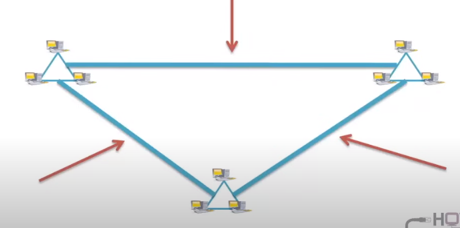

# 1.1 Theory and Terminology

Section **1.0 Networking Fundamentals**. Diagrams live in `img/` at the repo root.

## Network

An interconnected chain, group, or system. In this course a **computer network** is two or more computers connected so they can exchange data electronically.

Every network is built from four pieces:

| Piece | Role |
|---|---|
| Devices | Endpoints and infrastructure: computers, printers, phones, switches, routers |
| Media | The path the signal takes. Bounded (copper, fiber) or unbounded (radio, infrared) |
| Network adapter | Translates between the device and the media. Wired NICs and wireless radios are adapters |
| Network operating system | Rules that let devices share the media in order: addressing, permissions, name resolution, file and print services |

Without an adapter, the device cannot put bits on the wire. Without shared rules, the bits have no agreed meaning.

## Node

A **node** is any device attached to the network.

- **Endpoint nodes** are where data starts or stops: PCs, servers, printers, phones.
- **Redistribution nodes** forward traffic for others: switches, routers, and older hubs.

## Server, client, peer, terminal

**Server.** Hardware or software that shares a resource or runs a service for others. Examples: file server, DHCP server (hands out IP addresses), authentication server (controls permissions). A server manages network-wide functions so clients do not each invent their own rules.

**Client.** Hardware or software that *requests* a service. A client has its own processor and memory and does local work; it asks the server only for the shared part.

**Peer.** A node that provides its own resources and can act as both client and server. No dedicated server is required. This is the building block of a peer-to-peer network (see 1.2).

**Terminal.** A device that only enters and displays data. A classic terminal has no local processing or storage, so it is sometimes called a dumb terminal. A **terminal emulator** (SSH, Telnet, or a console program) draws that remote session on a real computer.

## Network backbone

The backbone carries the **majority of traffic** and runs faster than the access links that feed it. It joins smaller networks into one larger one.

| Backbone | How it is built | What it is good for |
|---|---|---|
| Serial | One backbone cable, many switches hung off it | Simple, one cable is a single point of failure |
| Hierarchical / distributed | Tree of links, typical of a LAN | Easy to manage and grow |
| Collapsed | A router or core switch is the single meeting point | Small sites; the core is the failure point |
| Parallel | Same idea as collapsed, with more than one cable | Redundancy: one link can fail and traffic still moves |

## How to use this section

When a later note says "node", "client", or "backbone", it means the definitions above. Addressing, cables, and protocols all sit on top of these four pieces: devices, media, adapters, and rules.

## One small network, with the words attached

Two PCs and a printer sit in one room. A switch joins them. A router in the closet is their way to the Internet. Walk the four pieces:

| Piece | In this room |
|---|---|
| Devices | The two PCs and the printer are endpoints. The switch and the router are redistribution nodes. The PC that asks for a file is the client. The PC that shares the file is acting as a server for that moment |
| Media | Copper from each desk to the switch. Fiber from the switch to the router if the closet is far. Wi-Fi, if a laptop has no cable, is unbounded media |
| Adapter | The NIC in each PC, and the radio if it is wireless. The switch ports are the adapters on the infrastructure side |
| Rules | Ethernet so the NICs share the copper, IP so a packet can leave the room, DHCP so a PC learns its address, DNS so a name becomes an address |

The **backbone** in a building this small is the link from the access switch up to the router. In a larger building it is the fast link between closets, and the desk cables are only the edges. A **serial** backbone is one of those links in a line of closets: cut it, and the closets past the cut are gone. A **parallel** backbone is two such links, so one cut does not isolate the floor.

A **terminal** is the old shape of a client that could not compute. The SSH window you open to the router is a terminal emulator: the router does the work, and your screen only shows it. The router is still a redistribution node. The session is just how you talk to it.
