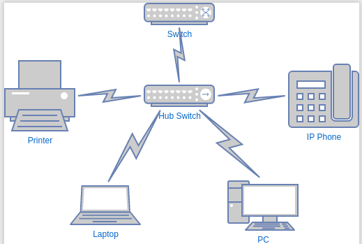
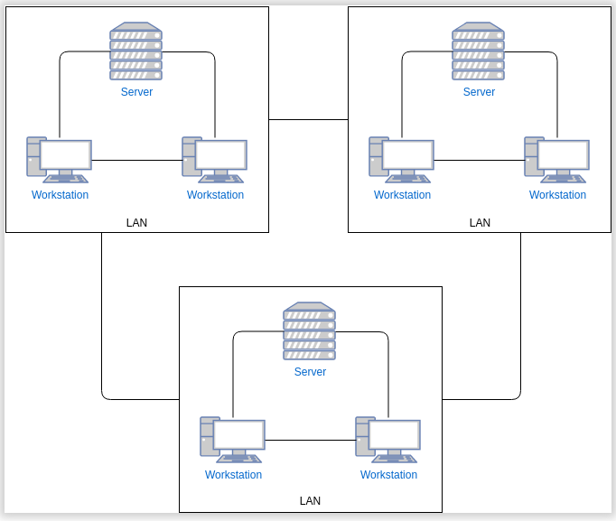
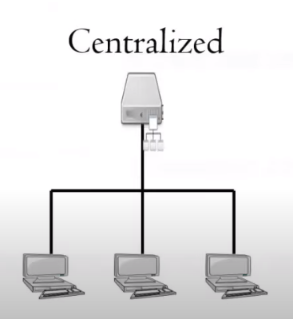
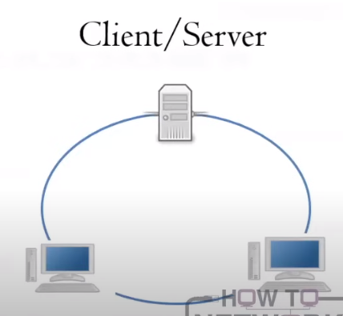
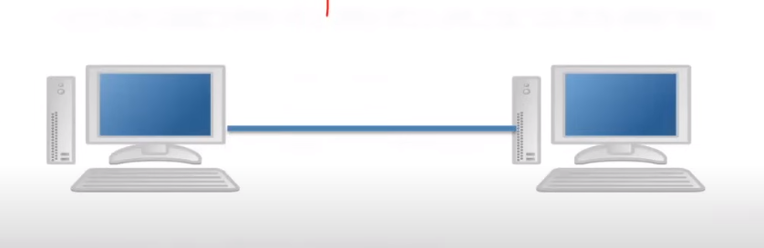

# 1.2 Categories of Networks and Models

Section **1.0 Networking Fundamentals**.

## Geographic categories

Size is about **distance and who owns the links**, not about how many computers are attached.

| Name | Scope | Typical links |
|---|---|---|
| PAN — Personal Area Network | One person's workspace | Bluetooth, USB, a phone tether |
| LAN — Local Area Network | A room, floor, or small building | Ethernet, short-range Wi-Fi. Nodes are directly connected. Usually the fastest category |
| CAN — Campus Area Network | Several LANs on one campus or site | Fiber between buildings. Smaller than a MAN |
| MAN — Metropolitan Area Network | A city | Joins LANs across a metro area. Often carries data, voice, and video |
| WAN — Wide Area Network | Cities, countries, or the planet | Leased lines, MPLS, satellite, carrier fiber. Connects LANs that are not next to each other |
| GAN — Global Area Network | Unlimited geography | A network of WANs. Loosely the same idea as the Internet |
| EN — Enterprise Network | One organization's LAN plus WAN | Owned and operated by a single company |

**LAN administrator** work is local and user-facing: hardware, software, installs, upgrades, and user requests.

**WAN administrator** work is network-facing: carrier circuits, wide-area routing, automation scripts, and network-wide upgrades. The skills are narrower and deeper.

## Internet, intranet, extranet

**Internet.** The public global network. It uses the TCP/IP suite. Anyone with a provider can join. Web pages and other data live on servers; a browser reaches them with a protocol such as HTTP on port 80. Every device that speaks on the Internet needs an IP address.

**Intranet.** A private network that uses the same protocols as the Internet (HTTP, DNS, and so on) but is limited to employees. It may connect *to* the Internet, but outsiders are not supposed to reach the private parts.

**Extranet.** A controlled slice of the private network opened to partners, vendors, suppliers, or a named set of customers. It is an extension of the intranet, not a second public Internet. The rest of the network stays closed.

## Segment

A **segment** is a portion of a network whose devices are separated from the rest by a connectivity device such as a switch or router. Later notes use this word for both physical segments and logical ones (VLANs). See 4.5.

## Network models

The model describes **where the work happens**, not the shape of the cables. Shape is topology (1.3).

### Centralized

Every user connects to one central host, historically a **mainframe**. The end devices are **terminals**.

- Easy to picture: one computer owns the data and the processing.
- Hard to maintain.
- If the path to the mainframe fails, the whole network stops doing useful work.

### Client/server

The server provides shared services: files, authentication, printing, addressing. Clients have their own CPU and memory, so they do local work and talk to the server only when they need a shared service. Resources can sit on the server or on the client, wherever they fit.

### Peer-to-peer (P2P)

Two or more systems share resources with no dedicated server. Each node is responsible for its own processing, sharing, and security. Simple for a handful of machines. It becomes messy as the network grows, because there is no single place for accounts, backups, or policy.

### Mixed mode

Uses more than one of the models above. A company file server (client/server) plus a small workgroup share (peer-to-peer) on the same LAN is mixed mode.
