# 1.3 Network Topologies

Section **1.0 Networking Fundamentals**.

A **topology** is the layout of the network: which devices connect to which, and which path data is allowed to take. Administrators use it to see how a frame or packet will move, and to predict what breaks when one link fails.

There are two maps, and they do not have to match:

| Map | Question it answers |
|---|---|
| Physical | How are the cables (or radios) actually plugged in? What shape is the wiring? |
| Logical | What path does the data take, regardless of the cable shape? |

A building can be wired as a physical star (every desk to a switch) and still behave like a logical bus if the central device repeats every frame to every port. That is how a hub works.

## Connection types

**Point-to-point.** One node talks only to one other node. A classic phone call, or a single cable between two routers.

**Multipoint.** One node connects to two or more nodes at once. The signal is not private; other nodes on that medium can hear it. A coax bus is multipoint.

**Radiated.** Wireless. It can be point-to-point (a microwave shot between two buildings) or multipoint (an access point and many laptops). A transmission aimed at everyone in range is a broadcast.

How many receivers a single transmission is *addressed* to:

| Type | Receivers |
|---|---|
| Unicast | One sender, one receiver. Other devices ignore it |
| Multicast | One sender, a subscribed group |
| Broadcast | One sender, every device in the broadcast domain |

## Physical bus

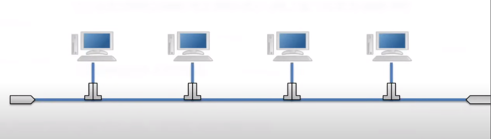

One shared cable. Every node taps it, historically with a T-connector. This is a multipoint connection.

The electrical signal travels to the end of the cable and would reflect back if nothing absorbed it. A reflected signal collides with new transmissions. A **terminator** (50 ohm on classic coax Ethernet) absorbs the signal so it does not bounce.

One break in the cable stops the whole segment. Adding a node means touching the shared cable.

## Physical star

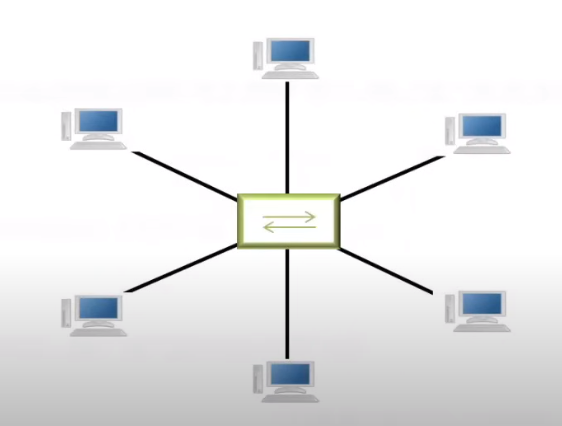

Every node has its own cable to a central device.

- A **hub** repeats the incoming signal out every other port. Logically this is still a bus: everyone hears everyone.
- A **switch** reads the destination MAC address and forwards the frame only to the port that needs it.

A cable failure takes down one node. The central device is a single point of failure unless you add a second one. This is the normal layout of a modern Ethernet LAN.

## Physical ring

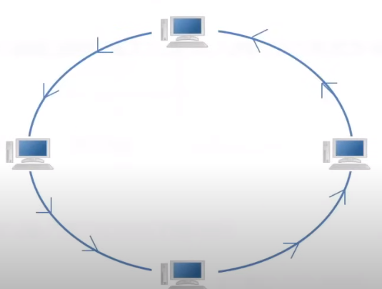

Each node connects only to its **upstream** and **downstream** neighbor. Traffic moves in one direction (unidirectional) or, on a dual ring, in both directions for protection.

Because each node receives and retransmits, the signal is regenerated and stays strong. There is no collision in a single-direction token ring: only the node holding the token may send.

A single break stops a one-way ring, because the path is a circle. Dual-ring designs (FDDI) wrap traffic back onto the second ring to survive one break.

## Physical tree (hierarchical)

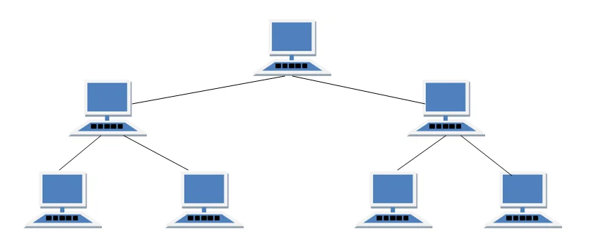

A root node with branches. Treat it as a hierarchy of at least three levels: root, distribution, and access. It scales by adding a branch instead of rewiring the whole network. Most campus LANs are a tree of stars (sometimes called a hierarchical star).

## Physical mesh

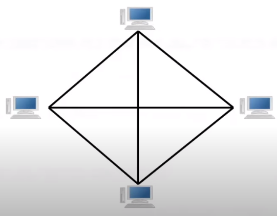

Nodes interconnect so that more than one path exists.

- **Full mesh:** every node links to every other node. Link count = `n(n − 1) / 2`. Reliable, and expensive. Used between a small number of WAN routers, not between 200 desktops.
- **Partial mesh:** only the important nodes have extra paths. This is the usual compromise.

## Hybrid

A hybrid combines two or more physical topologies.

- **Star-bus:** stars joined by a bus backbone.
- **Star of stars:** stars whose centers connect to another star. This is a normal switched LAN.
- **Star-ring:** stars whose centers are joined in a ring.

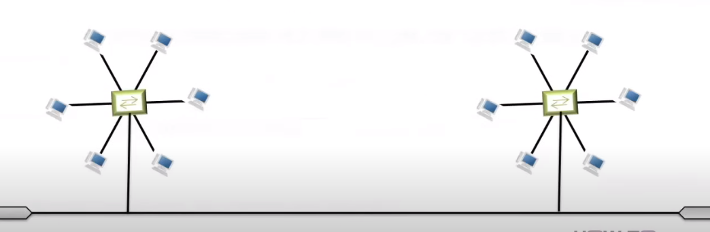

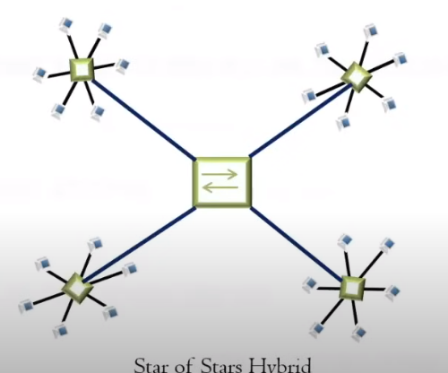

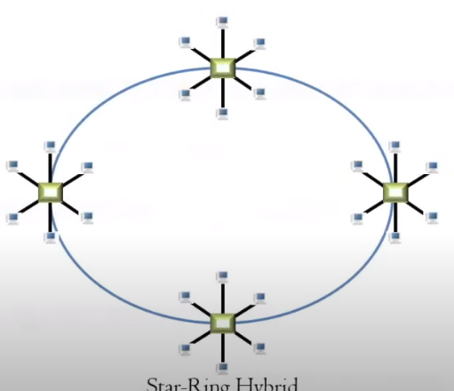

## Logical topologies

The logical map is the path data takes.

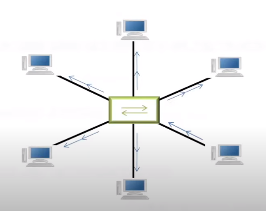

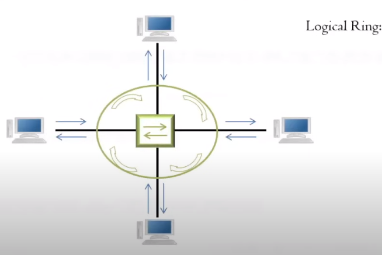

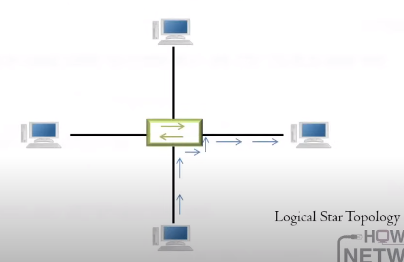

| Physical shape | Common logical behavior |
|---|---|
| Bus, or star of hubs | Logical bus. One collision domain |
| Token ring, or dual ring | Logical ring. Token controls who speaks |
| Star of switches | Logical star. Each port is its own collision domain; the switch chooses the exit |

When you troubleshoot, draw both maps. A link light proves the physical star. A broadcast storm or a wrong VLAN proves the logical path is not the one you think.

Campus layers (access, distribution, core), a collapsed core, spine-and-leaf, and north-south versus east-west traffic are in 12.1.
