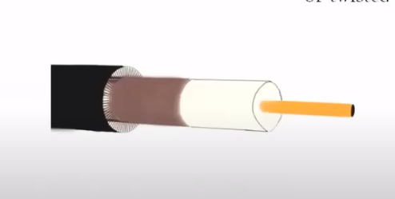
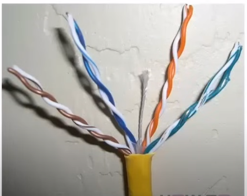
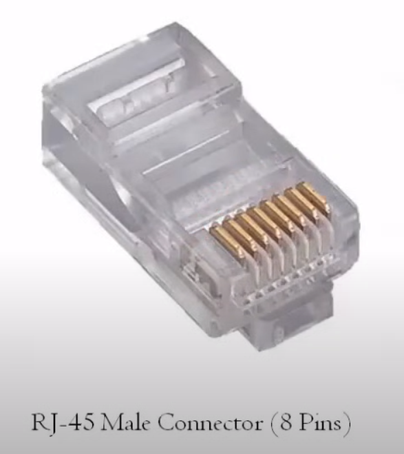
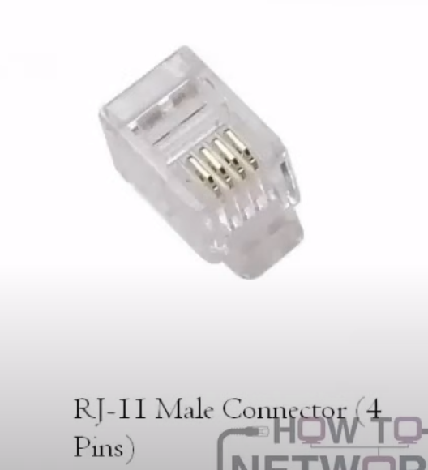
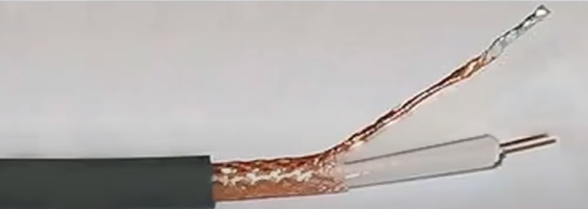
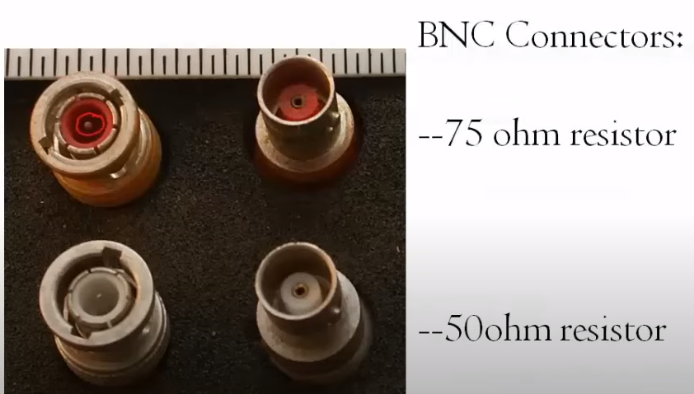
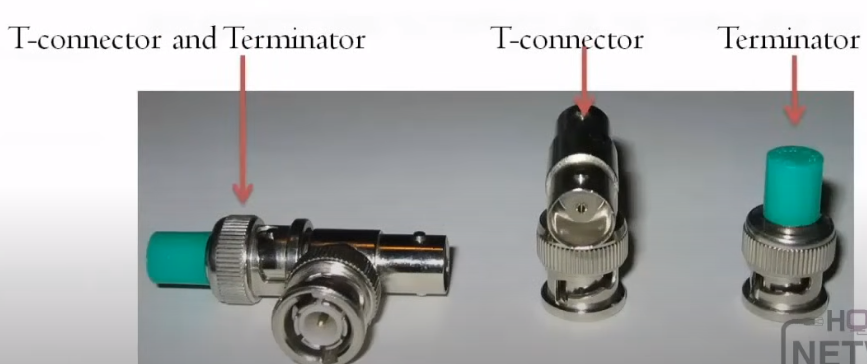
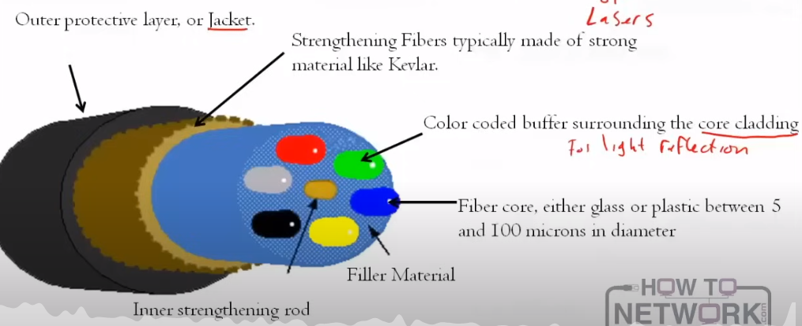
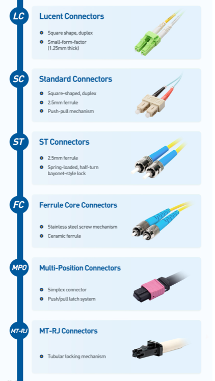

# 1.4 Bounded Media

Section **1.0 Networking Fundamentals**.

**Network media** is the path between devices. **Bounded media** is a physical conductor you can see and touch: copper wire, or a glass or plastic fiber. Unbounded media (radio, infrared) is 1.7.

## Copper

Copper is either one core (coax) or twisted pairs. The two everyday forms are coaxial cable and twisted pair.

### Twisted pair

Two insulated copper conductors twisted together. The twist makes noise that hits one wire hit the other almost equally, so the receiver can cancel it (differential signaling, 1.8). A cable holds several color-coded pairs inside an outer jacket. Data cables terminate on an **8P8C** plug, usually called RJ-45. Telephone cables often use **RJ-11** (up to 6 positions, commonly 4 or 6 contacts).

**Shielded twisted pair (STP).** A foil or braid around the pairs, sometimes around each pair and the bundle. The shield must be grounded or it can make interference worse. STP costs more and is stiffer to pull. Use it when EMI is high (motors, fluorescent ballasts, factories).

**Unshielded twisted pair (UTP).** No metal shield. Cheaper, lighter, and what most offices use. More exposed to EMI, so route it away from power cables and do not crush the twists when terminating.

### Categories

The category is a performance grade: bandwidth in MHz, and how well the pairs reject crosstalk. Higher category cable can run slower standards. The reverse is not safe.

| Category | Bandwidth | What to remember |
|---|---|---|
| Cat 3 | 16 MHz | 10BASE-T (10 Mbps) and voice. Legacy |
| Cat 5 | 100 MHz | 100BASE-TX (100 Mbps). Not for new installs |
| Cat 5e | 100 MHz | The "e" fixes crosstalk so the cable can carry **1 Gbps** (1000BASE-T) to 100 m |
| Cat 6 | 250 MHz | 1 Gbps to 100 m, **10 Gbps only to about 55 m** |
| Cat 6a | 500 MHz | 10 Gbps to 100 m. The TIA recommendation for new horizontal cable in the 568-C era |
| Cat 7 | 600 MHz | 10 Gbps, heavily shielded. An ISO/IEC class, not a TIA category. Different connectors (GG45, TERA), not plain RJ-45 |
| Cat 8 | 2000 MHz | 25 or 40 Gbps to **30 m**. Data-center links, not desk runs |

Cat 1 and Cat 2 are voice and old token-ring grades. You will not install them.

A common exam trap: Cat 5e is 1 Gbps, not "about 350 Mbps". Cat 6 is not automatically 10 Gbps for a full 100 m run. That is Cat 6a.

### Coaxial

One copper core, a dielectric insulator, a braided shield, and an outer jacket. The shield is the return path and the EMI barrier. Impedance must match the circuit (50 ohm vs 75 ohm). Mixing them causes reflections.

| Type | Impedance | Use |
|---|---|---|
| RG-58 | 50 ohm | Thinnet, 10BASE2. About 5 mm |
| RG-8 / RG-11 | 50 ohm | Thicknet, 10BASE5. About 10 mm |
| RG-59 | 75 ohm | Short baseband video, older CCTV |
| RG-6 | 75 ohm | Cable TV, satellite, cable modems. Thicker than RG-59, less loss |
| RG-62 | 93 ohm | ARCNET. Historical |

Connectors: **BNC** (twist-lock, thinnet), **F-type** (cable TV, threaded), and older **N** connectors on thicknet. Vampire taps and AUI belong to thicknet history.

## Fiber

A glass or plastic **core** carries light. **Cladding** has a lower refractive index, so light that hits the boundary reflects back into the core (total internal reflection). A buffer and jacket protect the glass. Fiber does not carry electricity, so it is immune to EMI and does not conduct lightning into a building. It is the right choice for long runs, between buildings, and anywhere copper would pick up noise.

| Mode | Core | Light source | Distance | Notes |
|---|---|---|---|---|
| Single-mode (SMF) | About 8–10 μm | Laser | Kilometers to tens of kilometers | One path through the core. Yellow jacket is common. Used for long haul and 10GBASE-LR / ER style links |
| Multimode (MMF) | 50 μm or 62.5 μm | LED or VCSEL | Hundreds of meters | Many paths (modes). Orange (OM1/OM2) or aqua (OM3/OM4) jackets are common. Cheaper optics, shorter reach |

**Step-index multimode** has an abrupt change in refractive index at the cladding. Different rays arrive at different times (**modal dispersion**), which smears the pulse and limits speed and distance.

**Graded-index multimode** changes the index gradually, so outer rays speed up and inner rays slow down. The pulses stay tighter. This is what modern OM3/OM4 multimode is.

Connectors you must recognize: **ST** (bayonet), **SC** (push-pull square), **LC** (small, the usual one on SFPs), **MTRJ** (two fibers, one plastic body).

**Media converters** join unlike media when you cannot replace the cable: multimode to Ethernet copper, single-mode to copper, single-mode to multimode, fiber to coax. They are a convenience, not a design you want in the middle of a new install.

## Structured cabling

TIA-568 describes a commercial building as six pieces:

| Piece | What it is |
|---|---|
| Entrance facility | Where the carrier enters, the **demarcation point** (demarc), and the start of the backbone |
| Backbone | Cables between closets and equipment rooms. Also called vertical or riser cabling |
| Equipment room | Main cross-connect. Termination of the backbone. Often the MDF |
| Telecommunications room (closet) | Patch panels and switches for nearby desks. Intermediate cross-connects |
| Horizontal cabling | From the closet to the work-area outlet. Permanent link, 90 m max for copper plus patch cords |
| Work area | Faceplate, patch cord, and the station. Everything from the wall to the PC |

**568-A** is the older commercial standard. **568-B** added performance grades for UTP, STP, and fiber; parts of it are obsolete. **568-C** (and later revisions) is the family to follow for new work. It points new horizontal runs at Cat 6a when 10 Gbps to the desk is the goal. The pinout letters T568A and T568B (1.5) are wiring schemes inside these standards. Do not confuse "568-A the standard" with "T568A the pinout".

### Premise hardware

| Term | Meaning |
|---|---|
| Demarc | The point where carrier responsibility ends and yours begins |
| MDF | Main distribution frame. The primary hub of the building cable |
| IDF | Intermediate distribution frame. A closet frame between the MDF and the users |
| Patch panel | A row of jacks that terminates horizontal or backbone cable. You patch with short cords instead of moving the permanent cable |
| Patch cable | The short stranded cord from panel to switch, or from wall to PC |
| Drop cable | The last outside span from the feeder to the subscriber |
| Wiring closet | The room that holds the IDF, panels, and switches |

Horizontal cable is solid-core (better electrical performance, worse if flexed daily). Patch cords are stranded (flexes without breaking). Do not crimp a solid-core horizontal run onto a plug and call it a patch cord if you can land it on a jack instead.

## Plenum, riser, and PVC

The jacket rating is a **fire code** choice, not a speed choice.

| Jacket | Where it is allowed | Behavior in a fire |
|---|---|---|
| PVC / CM (general) | Open rooms, not air spaces or riser shafts | Burns and releases toxic smoke. Fire can travel along the cable |
| Riser (CMR) | Vertical shafts between floors | Resists carrying fire up the shaft. Not for plenums |
| Plenum (CMP) | Air-handling spaces: above a drop ceiling or under a raised floor that is part of the HVAC path | Low smoke, low flame spread. Costs more than PVC |

If the ceiling is a return-air plenum, the cable in it must be plenum-rated. Painting a PVC cable does not make it plenum cable.
