# 1.5 Straight-Through, Crossover, and Rollover

Section **1.0 Networking Fundamentals**.

## Modular connectors

A modular connector is the plastic plug and jack used on telephones, Ethernet, and some low-speed serial cables. Other names: RJ connector, modular phone plug, Western plug.

- The **plug** is the male end you crimp onto cable.
- The **jack** (socket) is the female end fixed on a NIC, switch, or wall plate.

The Ethernet plug is an **8P8C** connector: 8 positions, 8 contacts. People call it RJ-45. The original RJ-45 registered-jack specification is not the same thing as an Ethernet plug, but the name has stuck. It only *looks* like a larger RJ-11.

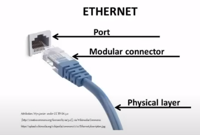

## T568A and T568B

TIA-568 says a 4-pair, 100 ohm cable lands on an 8-position jack in one of two pinouts. Pins are numbered 1–8 with the clip down and the contacts facing you, left to right.

The two schemes swap the **orange** and **green** pairs. Blue and brown stay put.

| Pin | Pair | T568A | T568B |
|---|---|---|---|
| 1 | pair 3 / pair 2 | white/green | white/orange |
| 2 | | green | orange |
| 3 | pair 2 / pair 3 | white/orange | white/green |
| 4 | pair 1 | blue | blue |
| 5 | | white/blue | white/blue |
| 6 | | orange | green |
| 7 | pair 4 | white/brown | white/brown |
| 8 | | brown | brown |

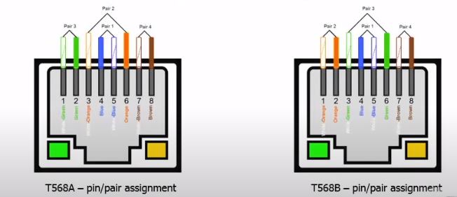

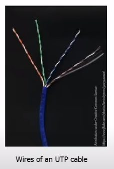

T568A is the scheme the standard prefers for new horizontal cable, and it matches US government work. T568B won in the field because it matches the older AT&T 258A pinout that was already installed. Either is fine. **Both ends of a straight-through cable must use the same scheme.** Mixing them on purpose makes a crossover.

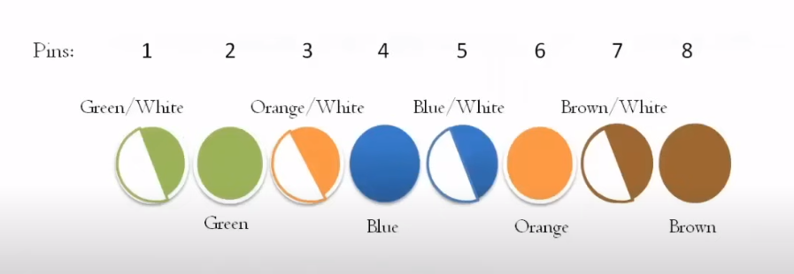

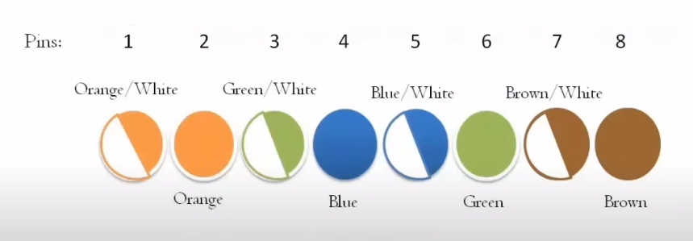

## MDI and MDI-X

**MDI** (medium dependent interface) is the pinout on a NIC. On 10BASE-T and 100BASE-TX the NIC **transmits on pins 1–2** and **receives on pins 3–6**.

**MDI-X** is the crossed pinout on a hub or switch port. The switch receives on 1–2 and transmits on 3–6. A straight cable then lines up: the PC's transmit pair arrives on the switch's receive pair.

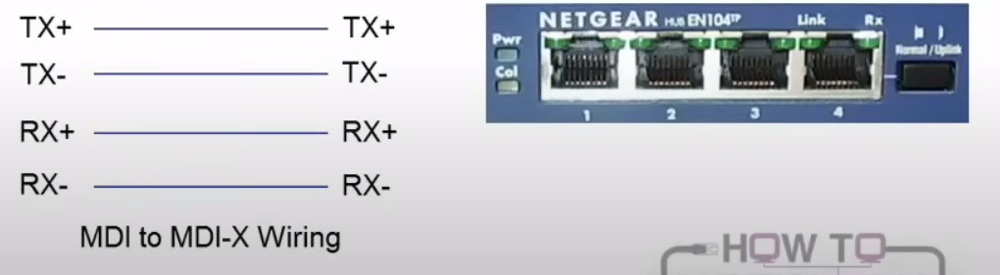

Pins 4–5 (blue) and 7–8 (brown) are unused by 10 and 100 Mbps Ethernet. **1000BASE-T uses all four pairs**, both directions at once, with hybrids and echo cancellation instead of a dedicated transmit pair.

## Straight-through

Same pinout on both ends (A-to-A or B-to-B). Used between **unlike** devices: MDI to MDI-X. PC to switch, router to switch, PC to wall jack to patch panel to switch. This is the normal patch cable.

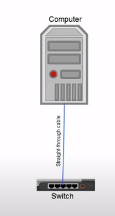

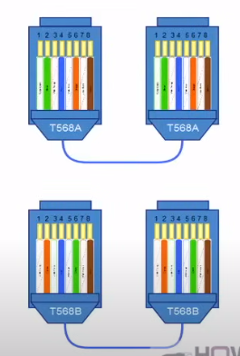

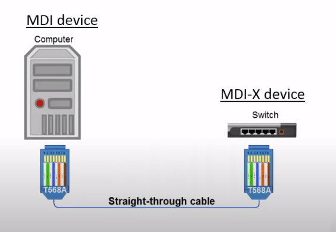

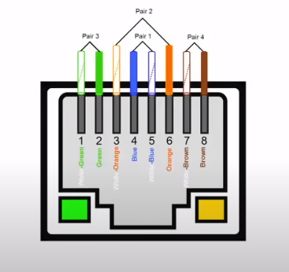

On 10BASE-T and 100BASE-TX:

- PC pins 1–2 transmit. The switch receives that pair on its pins 1–2 (because the switch port is MDI-X).
- Switch pins 3–6 transmit. The PC receives on 3–6.

## Crossover

Different pinouts on the two ends (A on one end, B on the other). Used between **like** devices, so transmit meets receive:

- PC to PC
- Switch to switch
- Router to router
- PC directly to a router Ethernet port (both are MDI)

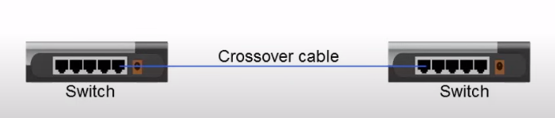

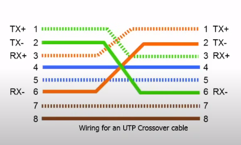

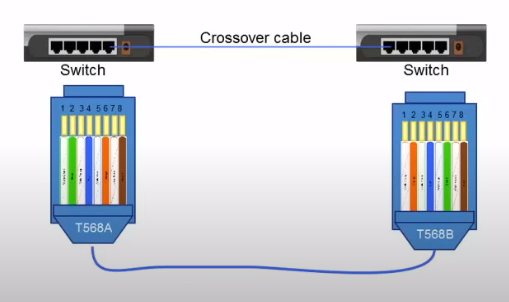

For 10/100 Mbps the crossover swaps pair 1–2 with pair 3–6. For gigabit, a full crossover also swaps pair 4–5 with pair 7–8. You almost never build that by hand anymore.

**Auto-MDI-X** detects the cable and flips the port's transmit and receive internally. Nearly every modern NIC and switch port has it, so a straight cable works switch-to-switch. Know the crossover rule anyway: old gear, and exam questions, still use it. Auto-MDI-X does not fix a cable that is wired with a split pair.

## Rollover (console / Yost)

A rollover cable talks to the **console port** of a switch or router, not to an Ethernet network. Pin 1 on one end goes to pin 8 on the other, pin 2 to pin 7, and so on. One end is 8P8C. The other is RS-232, usually DE-9 (people say DB-9), or a USB serial adapter on newer laptops. Cisco's light-blue console cable is the common example. Dave Yost published the pinout, so it is also called a Yost cable.

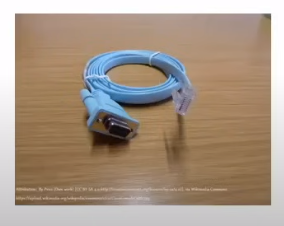

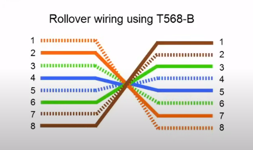

You use it when there is no network yet: first-time setup, password recovery, or a device that will not boot its IP stack.

## Horizontal cabling, again

Horizontal cable runs from the telecom room to the outlet. It may be plenum-rated if it is in an air-handling space. At the closet it lands on a patch panel or a punch-down block, and backbone cable joins that closet to the MDF.

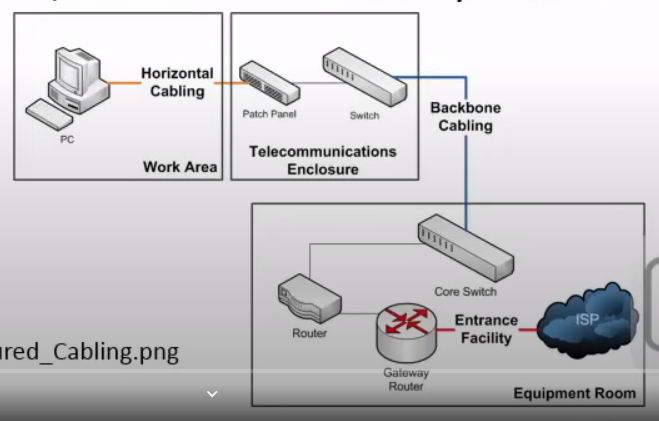

The permanent link (jack to patch panel) is specified to 90 m. Patch cords at the two ends bring the **channel** to 100 m. That 100 m limit is the twisted-pair Ethernet channel, not a suggestion.
