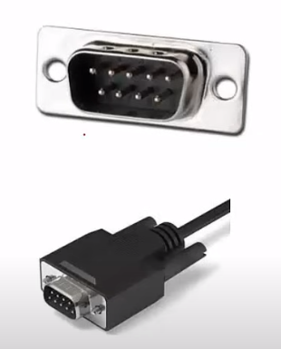
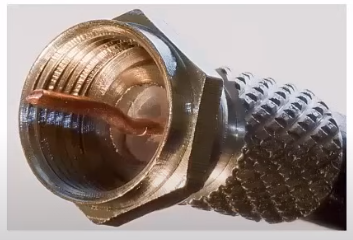
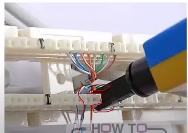
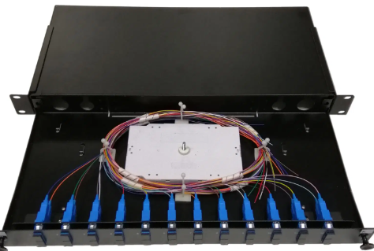
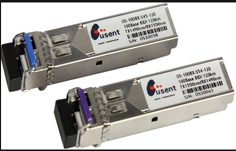
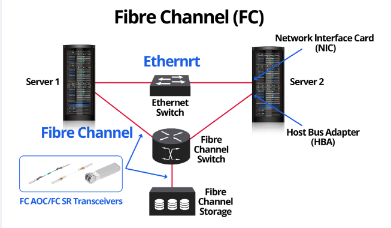
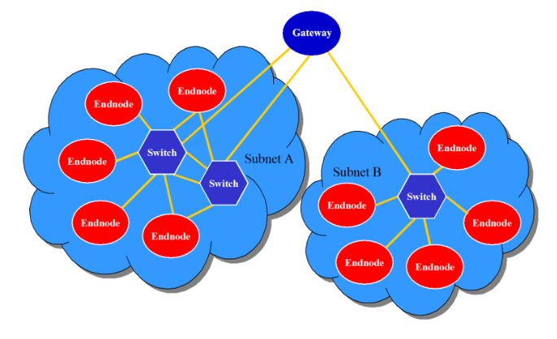

# 1.6 Connectors, Panels, and Transceivers

Section **1.0 Networking Fundamentals**.

## D-subminiature (DB / DE) connectors

The metal shell is shaped like a D so the plug only fits one way. The number is the pin count. These were serial ports, token-ring media units, old mice, and external floppy drives. USB replaced them on PCs. Network gear still uses **DE-9** (often mislabeled DB-9) for RS-232 console ports. DB-25 is the older, wider RS-232 connector.

## F connector

A threaded coax connector for 75 ohm cable. Cable TV, satellite, and cable modems. It passes RF into the GHz range. The copper center conductor of the cable *is* the pin, so a badly stripped cable shorts the connector.

## Punch-down blocks

Solid copper is pushed into a split metal slot. The slot cuts the insulation and holds the wire. No plug is crimped on the permanent cable.

| Block | Use |
|---|---|
| 66-block | Older voice. 50 rows. Crosstalk is too high for 100 Mbps data |
| 110-block | Replaced the 66-block for data and modern voice. Cat 5e and Cat 6 horizontal runs often land here or on a patch panel |

A **patch panel** is the same idea with RJ-45 jacks on the front. You do not swing a permanent cable every time a user moves. You move a patch cord.

## Fiber distribution panel

Also called a fiber distribution hub (FDH). Backbone fiber is spliced or connectorized inside the panel so each strand can be patched. The panel is the fiber version of a copper patch field. Keep the bend radius loose; a kink cracks the glass and the link fails with no obvious cut.

## Transceivers

A transceiver is a transmitter plus a receiver. On a fixed NIC it is soldered down. On a switch it is a hot-swap module so one port can be copper, short fiber, or long fiber.

| Module | Speed (typical) | Notes |
|---|---|---|
| GBIC | 1 Gbit/s | Older, large. Gigabit Interface Converter |
| SFP | 1 Gbit/s | Small form-factor pluggable. Replaced the GBIC |
| SFP+ | Up to 16 Gbit/s, usually 10 Gbit/s | Same cage size as SFP, faster electronics |
| QSFP | 4 lanes | 4×1, 4×10, 4×14, or 4×28 Gbit/s depending on generation |
| QSFP+ | 40 Gbit/s | Four 10 Gbit/s lanes |
| QSFP28 | 100 Gbit/s | Four 25 Gbit/s lanes |

Match the module to the fiber: SX/SR optics are multimode and short, LX/LR are single-mode and longer, ZX/ER are extended reach. A single-mode laser into old multimode fiber does not "just work" at the distance printed on the box. Wavelength (850 nm, 1310 nm, 1550 nm) must match on both ends.

## Storage fabrics you will see next to Ethernet

**Fibre Channel over Ethernet (FCoE)** wraps Fibre Channel frames in Ethernet so a SAN can share a 10 GbE cable. It is **not routable**. It needs a lossless Ethernet (priority flow control, data center bridging) and stays inside one fabric. It is not iSCSI.

**iSCSI** carries SCSI commands over **TCP/IP**. It is routable, uses ordinary NICs, and commonly rides TCP ports 860 and 3260.

**InfiniBand** is a high-throughput, low-latency fabric used in high-performance computing. Links can be direct or switched, between servers and storage. It is its own protocol, not Ethernet.

