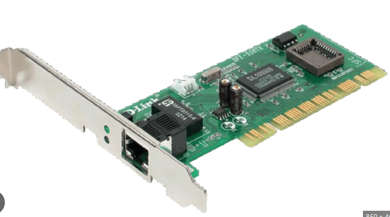
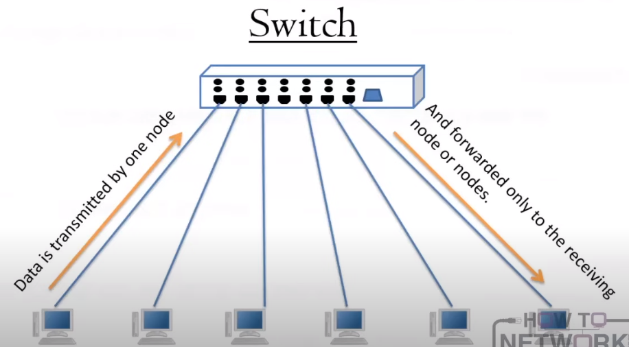
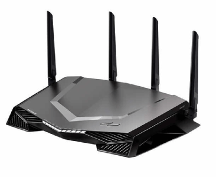
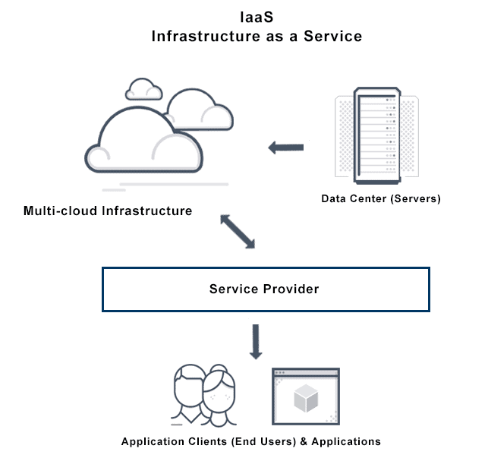
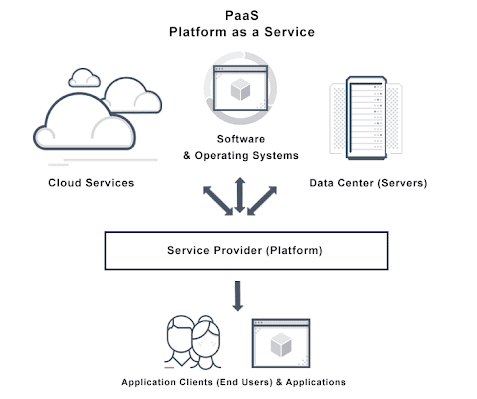
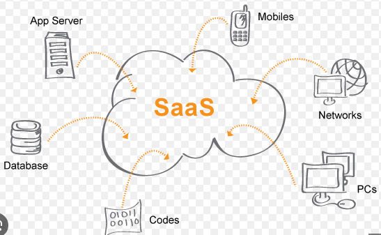
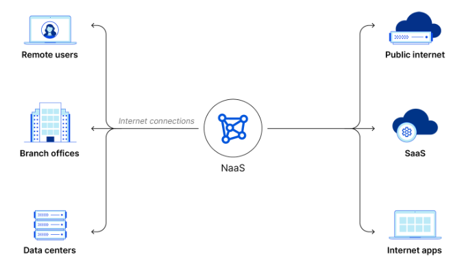
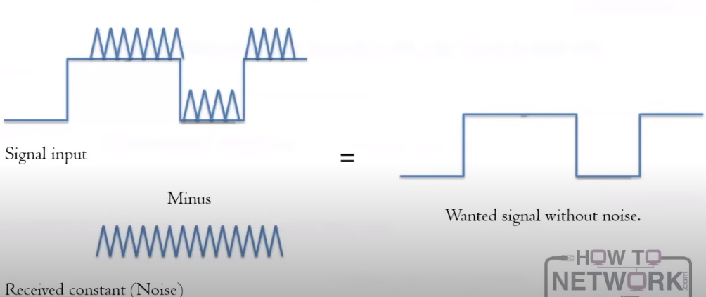

# 1.8 Connectivity Devices

Section **1.0 Networking Fundamentals**.

Devices are easier to remember by the address they read and the domain they shrink.

| Device | OSI layer | Address it uses | What it separates |
|---|---|---|---|
| Hub, repeater | 1 | None. It repeats bits | Nothing. It extends one collision domain |
| NIC | 1 and 2 | Its own MAC | The host from the media |
| Bridge, switch | 2 | MAC | Collision domains, one per port on a switch |
| Router | 3 | IP | Broadcast domains |
| Gateway | 3 and up, depending on type | Whatever the two protocols require | Networks that do not speak the same protocol |

## Network interface card

The NIC is the adapter from 1.1. It may be a PCIe card, a chip on the motherboard, a USB dongle, or a radio. The Ethernet jack faces the media. Link and activity LEDs show physical link and traffic. The NIC owns a burned-in **MAC address** and is where you set speed and duplex if you are not using autonegotiation.

## Transceiver

Transmitter plus receiver. On a simple NIC it is part of the card. On a switch it is often a GBIC, SFP, or SFP+ (1.6).

## Switch

The switch is the center of a modern star. It learns which **MAC address** lives on which port and forwards a unicast frame only there. Unknown unicasts and broadcasts still go out every port in the VLAN.

A **managed** switch has a console port, an IP address, or both, so you can configure it. An unmanaged switch is plug-and-play and has no settings.

Features you will configure later in the course:

| Feature | What it does |
|---|---|
| Port mirroring (SPAN) | Copies frames from one port to another so a sniffer can see them |
| Link aggregation | Bundles two or more physical links into one logical link. Also called EtherChannel, port channel, bonding, or teaming. LACP (IEEE 802.3ad / 802.1AX) negotiates it |
| VLANs | Several logical switches inside one chassis (4.5) |
| PoE | The switch feeds DC power down the copper pairs to an AP or a phone |

**NIC teaming** is the host-side version of link aggregation: several NICs, one logical interface. It is not the same thing as a switch port channel, and it does not merge the NICs into a single factory MAC by magic. The team has a MAC the switch must learn.

## Router

A router forwards **packets** using the destination **IP address** and a routing table. It does not forward broadcasts. Each interface is a different IP network. A router can be a dedicated box, a function inside a home gateway, or software on a host that has two NICs (a common virtual-router pattern).

Only **routable** protocols cross a router. IP is routable. NetBEUI was not. A switch cannot replace a router when the two hosts are on different IP networks.

## Gateway

In casual speech "gateway" means the router address hosts use as their default route. Strictly, a gateway **translates between dissimilar protocols or architectures** (for example an old SNA network and IP). It can be hardware, or software inside a router. When an exam question says "dissimilar networks", it wants gateway, not switch.

## Virtual devices

| Thing | What it actually is |
|---|---|
| Virtual switch | A software switch inside a hypervisor. VMs on the same vSwitch can talk. Two vSwitches do not forward to each other unless you connect them with a router or an uplink |
| Virtual router | Routing software, or a VM with two virtual NICs |
| Virtual server / virtual machine | A guest with virtual CPU, RAM, disk, and NIC, scheduled by the hypervisor. It is independent of other guests |
| Virtual desktop | Several user desktops on one OS session, or a desktop VM (VDI). Linux has long had multiple desktops; Windows does too. VDI is the network topic: the desktop runs in the data center and the screen is remoted |

## Cloud service models

You rent a slice of someone else's stack instead of buying the hardware.

| Model | You rent | You still manage | Examples |
|---|---|---|---|
| IaaS | Servers, storage, network, virtualization | OS, middleware, applications, data | AWS EC2, Azure VMs, Google Compute Engine |
| PaaS | IaaS plus OS and runtime | The application and the data | Elastic Beanstalk, App Engine |
| SaaS | The finished application | Your data and your users | Google Workspace, Salesforce, Dropbox |
| NaaS | The network: routing, VPN, firewall, wireless, WAN | Policy, not the boxes | A cloud-delivered LAN/WAN, or virtual CPE |

A memory line that stays true: from IaaS to SaaS, you manage less, and the provider manages more.

## Legacy devices

**Repeater (layer 1).** Receives a weak signal, regenerates the bits, and sends them on. No addresses. It exists to beat the cable distance limit. Every repeater also repeats noise if it cannot fully regenerate.

**Hub (layer 1).** A multiport repeater. A frame in one port goes out all other ports. One collision domain, one bandwidth shared by every attached node. Half duplex. Hubs do not look at MAC addresses.

**Bridge (layer 2).** Joins two segments and forwards frames based on MAC address. A switch is a multiport bridge with hardware forwarding. Bridges were the two-port ancestors.

## Noise

Electrical noise is energy on the medium that is not your signal. Sources: EMI from motors and fluorescent lights, RFI from radios, crosstalk from the pair next door, and reflections from a bad termination or a wrong impedance.

**Grounding.** Bond the shield, or a drain wire, to a ground **at one point** (two grounds on a shield can form a ground loop and inject the noise you were trying to dump). Grounding is also a safety path for fault current. Performance grounding and safety grounding are both required; they are not interchangeable excuses to skip one of them.

**Shielding.** Foil or braid around the pairs acts as a Faraday cage. It cuts capacitive and inductive coupling both ways: noise in, and radiation out. An ungrounded shield is just a long antenna.

**Differential signaling.** The transmitter sends the signal on one wire and the inverted signal on the other. The receiver subtracts them. Noise that hits both wires equally (common mode) cancels in the subtraction. The twist in the pair is what makes the noise equal. This is why UTP works at all without a shield.

Other rules that keep noise down:

- Terminate bus and coax segments. An open end reflects.
- Match impedance (50 ohm Ethernet coax, 75 ohm video, 100 ohm UTP).
- Respect bend radius, pull tension, and the distance from power cable in the installation standard.
- Follow the vendor's grounding instructions. A shield grounded at both ends, or at neither, is a common self-inflicted fault.
