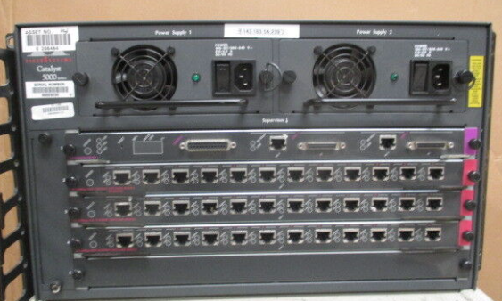
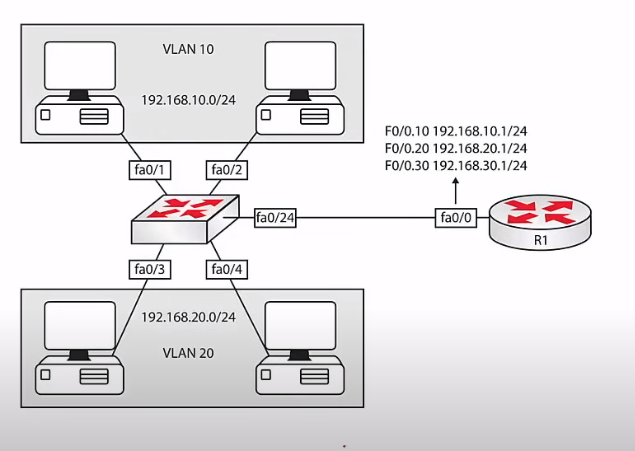
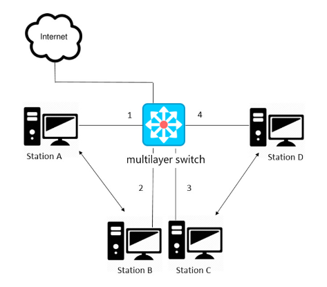
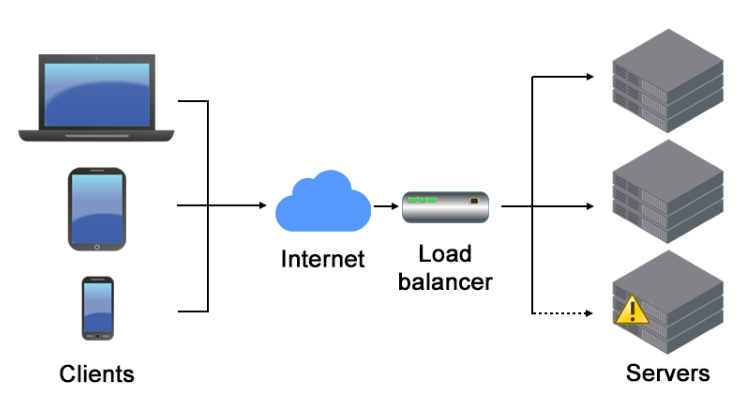
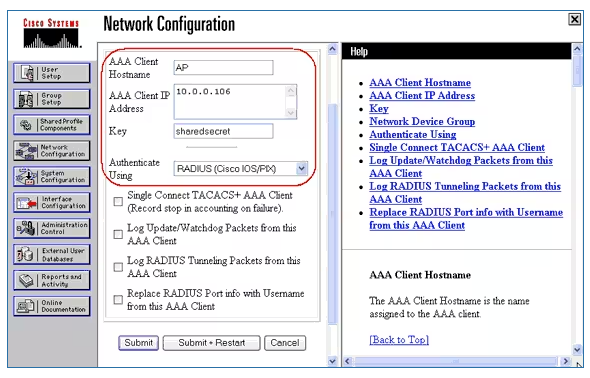
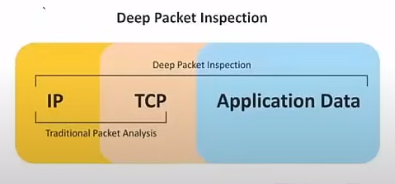
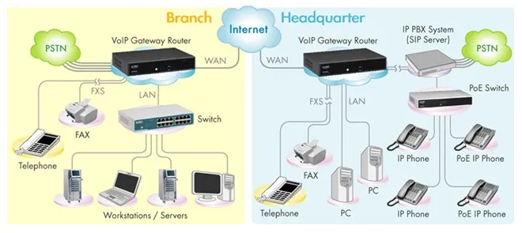
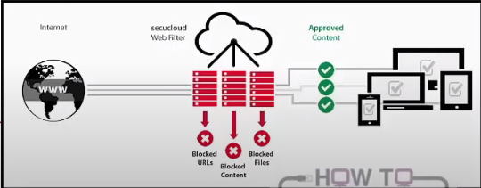

# 1.9 Advanced Networking Devices

Section **1.0 Networking Fundamentals**.

A 1990s LAN was a server, a router, a hub, and 10 Mbps half-duplex Ethernet. A current LAN adds multilayer switches, wireless, virtualization, voice, video, and a threat model that assumes the attacker is already inside. The devices below exist because a hub and a packet filter are no longer enough.

## Multilayer switch

A layer-2 switch forwards frames by MAC address. A **multilayer switch** can also route by IP, and higher-end models filter on port, application, or even content. Each port can be a switched access port or a routed port.

Use one when the routing between VLANs needs to happen at switch speed (hardware, not a slow external router). This is "routing at wire speed", sometimes sold as a layer-3 switch.

## Wireless LAN controller

A standalone AP makes every radio its own configuration point. A **wireless LAN controller** (WLC) pulls that configuration back to one place. The APs become **lightweight**: they forward frames and take their SSID, security, and channel from the controller.

Roaming means the client keeps its association and, inside one subnet, its IP address as it walks between APs.

- **Intra-controller roaming:** both APs are on the same controller.
- **Inter-controller roaming:** the APs are on different controllers, which must coordinate the client's session.

## Load balancer

A load balancer shares incoming work across two or more servers so one box is not the bottleneck and a dead server is skipped.

Clients talk to a **virtual IP address** (VIP). The balancer forwards each connection to a real server. Methods include round-robin, least connections, and hashing the client address. It is used for web, video, and database front ends. Health checks pull a dead server out of the pool.

## IDS and IPS

Both watch traffic for attacks and policy violations. Both can alert, log, or send an SNMP trap. The difference is **where they sit**.

| | IDS | IPS |
|---|---|---|
| Placement | Off to the side, on a mirror port | Inline, in the forwarding path |
| Can it drop the packet? | No. It only sees a copy | Yes. It can drop, reset, or rewrite |
| Failure mode | If it dies, traffic continues | If it dies, traffic may stop (unless it fails open) |
| False positive cost | A noisy alert | A blocked user |

## AAA and RADIUS

**AAA** separates three questions:

| Letter | Question | Example |
|---|---|---|
| Authentication | Who are you? | Password, certificate, token |
| Authorization | What may you do? | This user can SSH but not enter enable mode |
| Accounting | What did you do? | Start time, commands, bytes, disconnect |

RADIUS, TACACS+, and Kerberos are the usual ways to ask those questions of a central server instead of a local user list on every switch.

| Protocol | Transport | Encrypts | Typical use |
|---|---|---|---|
| RADIUS | UDP 1812 (auth) and 1813 (accounting). Older gear uses 1645/1646 | The password field, not the whole packet | Network access: Wi-Fi 802.1X, VPN, switches |
| TACACS+ | TCP 49 | The whole body | Device administration. Cisco-originated. Separates authorization from authentication cleanly |
| Kerberos | TCP/UDP 88 | Tickets | Windows and directory logon. A client gets a ticket instead of sending the password to every server |

## UTM

A **unified threat management** box puts several security functions in one appliance: firewall, VPN concentrator, antivirus gateway, IDS/IPS, and often content filtering. One policy screen, one support contract. The cost is a single point of failure and a performance ceiling: every feature you turn on shares the same CPU. Sophos and similar vendors sell this category.

## Next-generation firewall

A classic firewall filters IP addresses and ports. Most malware now arrives on ports you must leave open (80 and 443), inside the application. A **next-generation firewall** (NGFW) adds:

- Application identification (it knows HTTPS to a storage site from HTTPS to a bank)
- User identity, not just IP
- Intrusion prevention
- TLS inspection, so encrypted malware is not invisible
- Malware scanning and QoS

The technique underneath is **deep packet inspection**: looking past the headers into the payload, at line rate. Port blocking alone does not stop an attack that is allowed to use port 443.

## VoIP PBX

A **private branch exchange** is the company's phone switch. An **IP PBX** does that job on the LAN: extensions are IP addresses, and the phones share the data network. It can be a server or an appliance. A **voice gateway** converts between IP and the public switched telephone network when a call has to reach a normal phone number. Voice traffic needs QoS; it does not tolerate the delay that email ignores.

## Content filter

Software, or a proxy, that blocks destinations or file types by policy: malware sites, a category such as gambling, or `.exe` downloads. It can run on the PC, on a firewall, or at the ISP. Filtering HTTPS means the filter either trusts a site category from the certificate name (SNI) or intercepts TLS. The second one is a deliberate man-in-the-middle with a company certificate, and users should know it is there.

