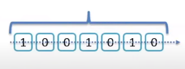
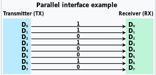
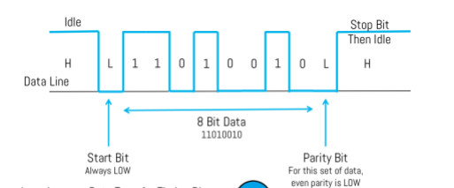
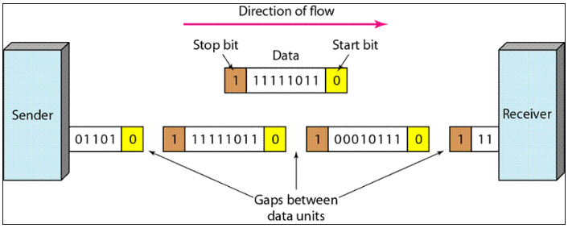
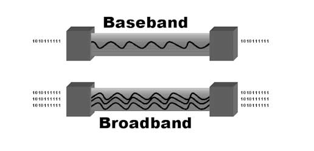

# 2.1 Data Transmissions

Section **2.0 Transmission and Access**.

**Data transmission** is the exchange of non-voice payloads (text, graphics, audio, video, files) across a medium. Telephony was originally voice only. A data network carries both, and voice is just another payload once it is packetized.

## Simplex, half duplex, full duplex

This is the missing half of every "how do bits move" question.

| Mode | Direction | Example |
|---|---|---|
| Simplex | One way only | Broadcast TV, a keyboard |
| Half duplex | Both ways, one way at a time | Hub Ethernet, a walkie-talkie, 802.11 (a radio cannot talk and listen on the same channel at once without extra hardware) |
| Full duplex | Both ways at the same time | Switched Ethernet, a telephone call |

10BASE-T on a hub is half duplex because of collisions. The same cable on a switch is full duplex: the pair that transmits and the pair that receives are separate, and there is no contention.

## Timing: synchronous and asynchronous

**Serial** transmission sends one bit after another on one channel. One byte is 8 bits in a row. Ethernet, USB, and SATA are serial. The clock problem is how the receiver knows where one bit ends.

**Parallel** transmission uses several wires at once. One character can be 8 bits side by side. Old parallel printer ports, the original PCI bus, and old SCSI are parallel. The wires have to stay the same length or the bits arrive skewed. That skew is why long links went serial.

**Synchronous.** A shared clock, or a clock recovered from the signal, keeps a continuous stream of blocks aligned. There is little per-byte overhead, so it is how you move a lot of data quickly. Ethernet framing is synchronous at the bit level once the preamble has locked the receiver's clock.

**Asynchronous.** No shared clock. Each byte is framed by a **start bit** and one or more **stop bits**, so the receiver can resynchronize every character. Overhead is high (start and stop on every byte). RS-232 console ports work this way. "Asynchronous" does not mean "unreliable". It means the timing is rebuilt per character.

**Instantaneous** transfer, in the sense used in these notes, means the data is not stored and forwarded as a complete file first. Chat, voice, and video conferencing encode and send as the content is produced. The opposite is a file copy, which can wait until the whole object exists.

## Baseband and broadband

"Band" is a range of frequencies. Bandwidth is how wide that range is.

**Baseband.** The digital signal uses the **entire** medium. There is one channel, from 0 Hz up. Bits go out as voltage or light pulses. Classic Ethernet is baseband, which is the "BASE" in 100BASE-TX. If you want several baseband conversations on one wire, you give each a time slot (**time-division multiplexing**, 2.2).

**Broadband.** The medium is split into **frequency channels**. Each channel is a separate carrier, often analog, and signals in one channel do not occupy the others. Cable TV is broadband: dozens of channels on one coax. Several broadband channels are combined with **frequency-division multiplexing**.

A useful correction to the shorthand "baseband is digital, broadband is analog": the exam-relevant difference is **one signal using the whole medium** versus **many signals separated by frequency**. Cable broadband carries digital DOCSIS on those analog channels.

## Broadband over power lines

BPL puts a data signal on the building's electrical wiring, above the 50/60 Hz power frequency, and couples it off with a modem. It reuses copper that is already in the walls. Real deployments got roughly DSL-class speeds and had problems with radio interference and with transformers blocking the signal. It is a niche technology, not a replacement for Ethernet. Power-line adapters sold for homes are the small version of the same idea.
