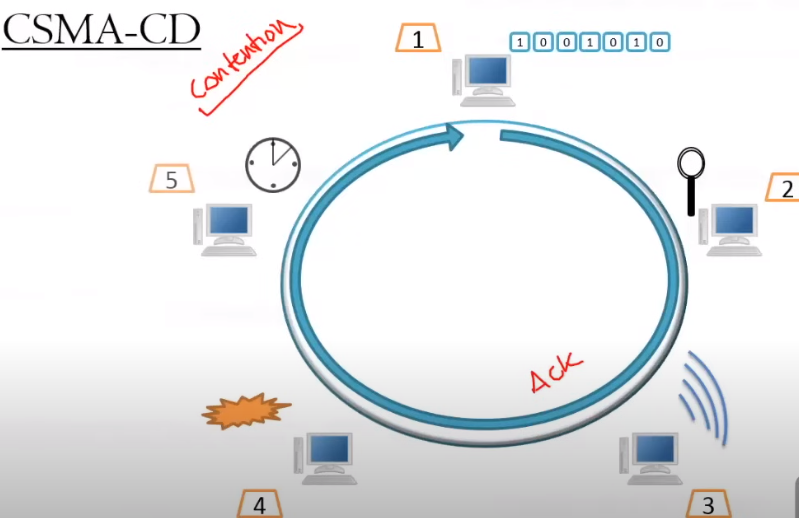
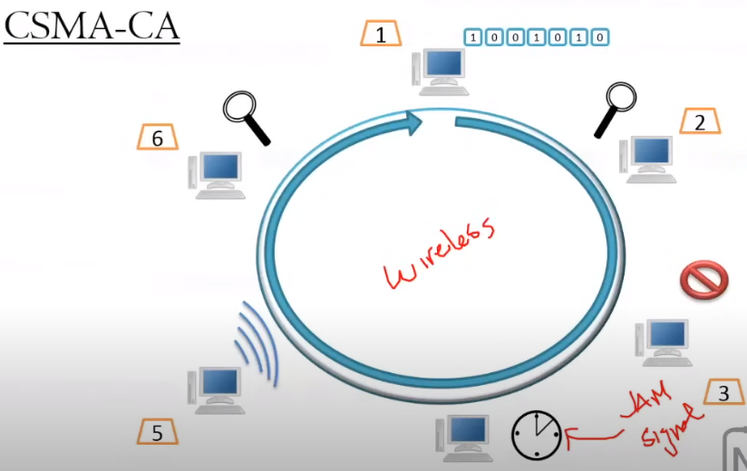
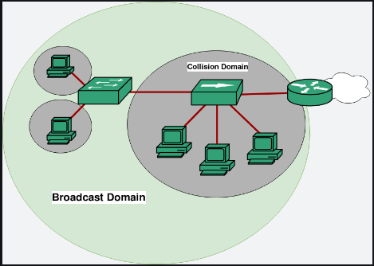

# 2.2 Media Access Methods

Section **2.0 Transmission and Access**.

**Media access** is the rule for which node may transmit, and when. Every node on a shared medium has to obey the same rule or frames overlap and both are lost. Switched full-duplex Ethernet barely needs this, because each link has only two devices and they use separate pairs. Shared coax, hubs, and Wi-Fi still do.

## Contention access

Nodes compete. Easy to build, and a busy node can make a quiet node wait. Also called competitive or collision-based access.

### CSMA/CD

**Carrier sense, multiple access, with collision detection.** Used by half-duplex Ethernet (shared coax and hubs).

1. A station with a frame listens (carrier sense).
2. If the medium is busy, it waits until the medium is idle.
3. It transmits.
4. While it transmits it keeps listening. On copper, a sender can hear another sender's signal mix with its own.
5. If it detects a collision, it stops, sends a short **jam** so every station knows the frame is garbage, and stops.
6. Each station waits a random **backoff** and tries again. The wait grows after repeated collisions (truncated binary exponential backoff) so the stations do not pick the same moment forever.

Collision detection needs the ability to listen while talking. A Wi-Fi radio that is transmitting is deaf, and a hidden station may be talking to the AP without this station hearing it. CSMA/CD is the wrong tool there. Full-duplex switched Ethernet does not use CSMA/CD at all: the switch port and the NIC each have the wire to themselves, so a collision is a duplex mismatch, not a normal event.

### CSMA/CA

**Carrier sense, multiple access, with collision avoidance.** Used by 802.11.

1. When a frame is ready, listen.
2. If the channel is busy, wait until it is idle.
3. Once it is idle, wait a fixed gap (DIFS) so acknowledgements and high-priority frames can go first.
4. Count down a random backoff, but only while the channel stays idle. This is the avoidance step.
5. Transmit the frame.
6. Wait for an **ACK**. No ACK before the timer expires means the frame was lost. Wait another backoff and start over.

Optional **RTS/CTS**: the sender asks for the channel (Request to Send), the AP grants it (Clear to Send), and everyone else who hears the CTS stays quiet. This reduces the hidden-node problem, at the cost of extra frames. It is worth it for large frames on a busy cell, not for every short packet.

### Collision domain and broadcast domain

A **collision domain** (contention domain) is the set of interfaces whose transmissions can collide. A hub is one collision domain for every port. A switch port is its own collision domain. A router port is its own collision domain.

A **broadcast domain** is the set of interfaces that receive a broadcast frame (Ethernet destination `FF:FF:FF:FF:FF:FF`). Switches forward broadcasts. **Routers do not.** Each router interface is a separate broadcast domain. A VLAN is a broadcast domain carved out of one switch.

| Device | Collision domains | Broadcast domains |
|---|---|---|
| Hub | 1 | 1 |
| Switch | 1 per port | 1 (or 1 per VLAN) |
| Router | 1 per port | 1 per port |

## Controlled access

A controller, or a token, decides who speaks. Harder to build. A station with urgent traffic can be guaranteed a turn, which contention cannot promise.

**Token passing.** A small frame, the token, circles the ring. Only the station holding the token may transmit, and only for a bounded time. Then it releases the token. Token Ring and FDDI work this way. There is no collision during normal operation.

**Polling.** A master asks each station, in order, whether it has data. Access is guaranteed. Time is wasted asking stations that have nothing to send, so polling is a poor fit for bursty, time-sensitive traffic unless the poll is smart.

**Demand priority.** A station signals the hub that it has traffic, and can mark that traffic high priority. The hub grants the turn. 100VG-AnyLAN used this. You mainly need to know it as a controlled-access method that is not a token and not CSMA.

## Multiplexing

Multiplexing puts several signals on one medium. A **multiplexer (mux)** combines them. A **demultiplexer (demux)** splits them at the far end.

| Method | How channels are separated | Pairs with |
|---|---|---|
| TDM — time-division | Each conversation gets a repeating time slot | Baseband. T1/E1, and the phone network |
| STDM — statistical TDM | Slots are given to stations that actually have data, instead of reserving empty slots | Packet networks. More efficient than fixed TDM |
| FDM — frequency-division | Each conversation gets a frequency band | Broadband. Cable TV, analog radio |
| WDM — wavelength-division | Same idea as FDM, but the "frequencies" are colors of light on one fiber | Metro and long-haul fiber. DWDM packs many wavelengths |

A mux is a controlled way to share. It is not a switch: the slots or frequencies are assigned by the mux, not by a MAC address lookup.
