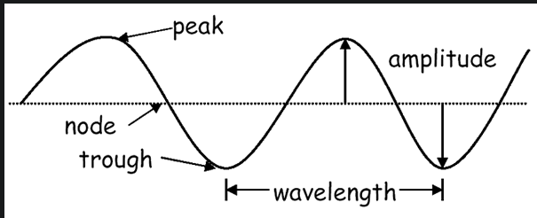
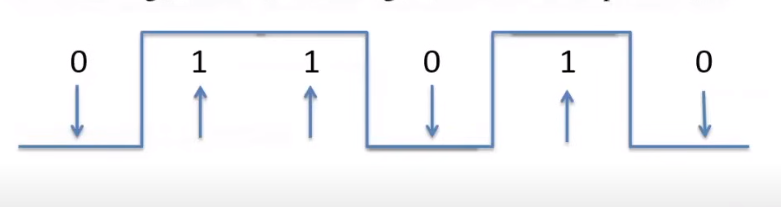
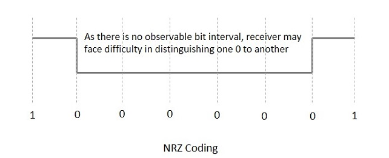
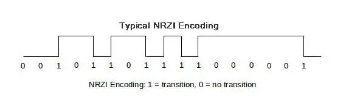
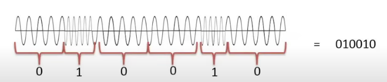
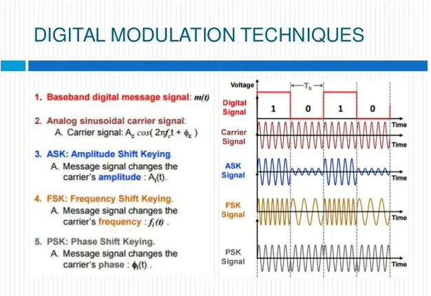
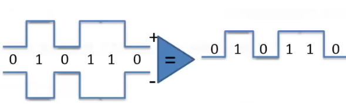

# 2.3 Signaling Methods

Section **2.0 Transmission and Access**.

A **signal** is data turned into energy a transmitter can send and a receiver can measure: voltage, current, light, or a radio wave.

## Analog and digital

**Analog.** A continuous waveform. Time and amplitude can take any value in range. Voice in the air, and an old telephone local loop, are analog. Analog signals pick up noise, and each copy adds that noise to the waveform.

**Digital.** A sequence of discrete states. In binary that is two voltages, or light on and off, standing for 1 and 0. Noise matters only if it is large enough to push a sample across the decision threshold. Past that threshold the receiver regenerates a clean 1 or 0. This is why long digital links stay cleaner than long analog ones.

Each bit occupies a fixed time slot. The sender and receiver have to agree on that slot. A preamble, start/stop bits, or a recovered clock provides the agreement (2.1).

## Line coding

Line coding is how 1 and 0 become voltages on a wire.

**NRZ (non-return to zero).** A high level is 1, a low level is 0, and the level stays constant for the whole bit. Long runs of the same bit give the receiver no edges, so it loses the clock. NRZ also has a DC component, which transformers and some optics do not pass.

**NRZI (non-return to zero, inverted).** A 1 is a *change* from the previous level. A 0 is *no change*. The absolute voltage does not matter, only the transition. Long strings of 1s have plenty of edges. Long strings of 0s still do not. USB uses a scrambled NRZI so that long zero runs are broken up.

**Manchester.** Also called phase encoding. Every bit has a transition in the middle: one direction for 1, the other for 0. There is always an edge, so the clock is easy to recover, at the cost of needing twice the bandwidth of NRZ. Original 10BASE-T uses Manchester. Faster Ethernet moved to other codes (4B/5B, 8B/10B, PAM-5, PAM-16) that waste less bandwidth.

## Modulation

Modulation puts information onto a carrier wave by changing the carrier's amplitude, frequency, or phase. The carrier is a higher frequency than the data, which is how a low-rate signal rides a radio channel or a phone line, and how many calls share one medium (FDM).

**Demodulation** extracts the information again.

A **modem** (modulator-demodulator) turns a computer's digital signal into an analog channel signal and back. Dial-up modems did this on a phone line. Cable and DSL modems still do it on their own media.

A **codec** (coder-decoder) turns analog source material into digital samples, or compresses digital audio and video.

- ADC: analog to digital, at the sending end of a voice call.
- DAC: digital to analog, at the receiving end.

Do not swap the two words. A modem fits a digital device to an analog *channel*. A codec fits an analog *source* (or a bulky digital stream) into a digital system.

### Digital modulation methods

| Method | What changes | How many states |
|---|---|---|
| ASK — amplitude shift keying | Height of the wave | Two in the basic form: 1 and 0. On-off keying is the extreme, where 0 is "no carrier" |
| FSK — frequency shift keying | The carrier frequency | Two or more tones |
| BPSK — binary phase shift keying | Phase, by 180° | One bit per symbol |
| QPSK — quadrature phase shift keying | Phase, in four steps | Two bits per symbol: 00, 01, 10, 11 |
| QAM — quadrature amplitude modulation | Amplitude **and** phase | Many bits per symbol. 64-QAM is 6 bits, 256-QAM is 8. This is what 802.11 and cable use to go fast in a narrow channel |

QAM packs more bits into each symbol, and it needs a cleaner signal. When Wi-Fi drops from 256-QAM to QPSK as you walk away from the AP, that is the radio choosing a constellation the noise will not destroy.

## Reference methods

**Differential.** The receiver compares the signal with a related copy (the other wire of the pair, or the previous symbol) and the *difference* is the data. Noise common to both inputs cancels. This is the same idea as differential signaling in 1.8.

**Single-ended.** The receiver compares one wire to ground. Simpler, fewer pins, and every bit of noise on that wire shows up in the data. Fine for short, slow, on-board signals. A bad choice for a 100 m cable run.

## Units

| Name | Size |
|---|---|
| Bit (b) | 0 or 1 |
| Nibble | 4 bits |
| Byte, octet (B) | 8 bits. "Octet" is the word standards use, because not every old machine used 8-bit bytes |
| Word | The CPU's natural width: 16, 32, or 64 bits. Not a fixed network unit |

Network speeds are **bits per second** (b/s, kb/s, Mb/s, Gb/s). File sizes are **bytes**. A 1 Gb/s link moves about 125 MB/s before overhead, because 8 bits make a byte. Exam questions mix Mb and MB on purpose.

Storage vendors use powers of 10 (1 KB = 1000 bytes). Operating systems often use powers of 2 (1 KiB = 1024 bytes). Networking line rates are powers of 10: 1 Gb/s = 1,000,000,000 bits per second.
