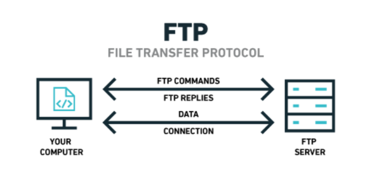
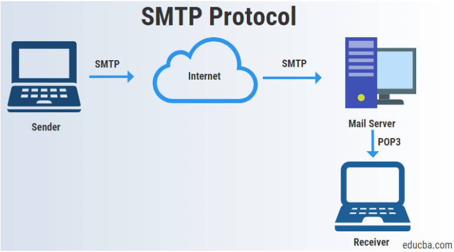
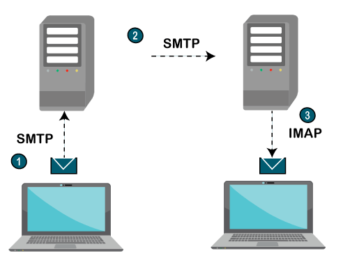
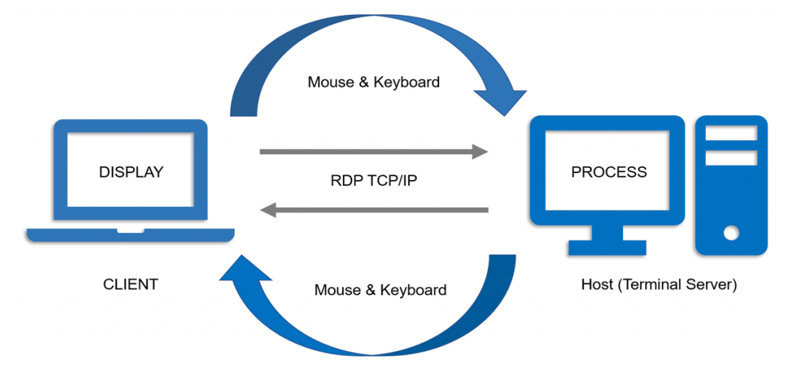

# 3.1 Ports and Protocols

Section **3.0 Protocols and Services**.

## What a port is

An IP address identifies a **host**. A **port** identifies a **program** on that host. The pair is a **socket**:

```text
192.0.2.10:443
```

That is one web server process on one machine. Another process on the same machine can use the same IP with a different port.

Ports are a transport-layer idea. They belong to **TCP and UDP**, not to IP itself, and not to ICMP. The range is **0–65535**.

| Range | Numbers | Who uses them |
|---|---|---|
| Well-known | 0–1023 | System services. Binding one usually takes administrator rights |
| Registered | 1024–49151 | Applications that reserved a number with IANA |
| Dynamic / ephemeral / private | 49152–65535 | The client end of a connection. The OS picks a free one for the duration of the session |

Port 0 is reserved. You do not configure a service on it.

A server listens on a well-known port. The client uses an ephemeral port. A reply comes back to that ephemeral port, which is how the PC tells two browser tabs apart when both talk to port 443.

## ICMP is not a port

Ping does **not** use port 7. Ping is an **ICMP echo request** (type 8) and echo reply (type 0). ICMP sits directly on IP, protocol number 1, beside TCP (6) and UDP (17). It has no port field.

Port 7 is the old Echo protocol, a TCP/UDP service that repeats what you send. It is not ping, and it should not be open.

## Ports to know

"Default" means the number IANA assigned and the number software uses unless someone changed it. A service can be moved. The protocol does not break if SSH listens on 2222, but every client has to be told.

| Port | Protocol | Transport | Direction of the data |
|---|---|---|---|
| 20 | FTP data | TCP | The file itself, in active mode |
| 21 | FTP control | TCP | Login and commands |
| 22 | SSH, also SCP and SFTP | TCP | Encrypted remote shell and file copy |
| 23 | Telnet | TCP | Remote shell, **plaintext** |
| 25 | SMTP | TCP | Sending mail, server to server |
| 53 | DNS | UDP and TCP | Queries are UDP. Zone transfers and large answers are TCP |
| 67 | DHCP server | UDP | Server side. Also the old BOOTP server port |
| 68 | DHCP client | UDP | Client side |
| 69 | TFTP | UDP | Trivial file transfer. No login, no directory listing |
| 80 | HTTP | TCP | Web, unencrypted |
| 110 | POP3 | TCP | Download mail, usually deleting it from the server |
| 119 | NNTP | TCP | Usenet news |
| 123 | NTP | UDP | Clock sync |
| 137 | NetBIOS name service | UDP | Legacy Windows name lookup |
| 138 | NetBIOS datagram | UDP | Legacy Windows browsing |
| 139 | NetBIOS session | TCP | Legacy Windows file sharing |
| 143 | IMAP | TCP | Read mail while it stays on the server |
| 161 | SNMP query | UDP | Poll a device |
| 162 | SNMP trap | UDP | The device pushes an alert |
| 389 | LDAP | TCP | Directory lookup and login |
| 443 | HTTPS | TCP | HTTP inside TLS |
| 445 | SMB | TCP | Windows file and printer sharing (direct hosting, no NetBIOS) |
| 465 | SMTPS | TCP | Legacy SMTP over SSL |
| 500 | IKE / ISAKMP | UDP | IPSec key exchange |
| 514 | Syslog | UDP (and TCP in modern syslog) | Log shipping |
| 587 | SMTP submission | TCP | Authenticated mail from a user to their mail server |
| 636 | LDAPS | TCP | LDAP over TLS |
| 993 | IMAPS | TCP | IMAP over TLS |
| 995 | POP3S | TCP | POP3 over TLS |
| 1433 | Microsoft SQL | TCP | Database. Often seen, not always on the objectives |
| 1701 | L2TP | UDP | VPN tunneling |
| 1723 | PPTP | TCP | Old VPN. GRE (IP protocol 47) carries the data |
| 1812 / 1813 | RADIUS | UDP | Authentication / accounting |
| 3389 | RDP | TCP | Remote Desktop |
| 4500 | IPSec NAT-T | UDP | IPSec through a NAT device |
| 5060 / 5061 | SIP / SIP-TLS | TCP or UDP | VoIP call setup, not the audio itself |

FTP's data port is the classic trap. **Active FTP:** the server connects back to the client from port 20, which firewalls hate. **Passive FTP:** the client opens the data connection to a port the server names, so only outbound connections are required.

TFTP is FTP's small relative: UDP, no authentication, used to boot diskless devices and to upload a router IOS image. Do not expose it.

## Protocol notes

### FTP

File Transfer Protocol moves files between two hosts. The control channel (21) carries the username and password **in the clear** on classic FTP. SFTP is a different protocol: it is FTP-like file transfer **over SSH**, on port 22. FTPS is FTP over TLS. They are not interchangeable.



### SMTP, POP3, IMAP



**SMTP** (25) carries mail from a client to a server, and from server to server. It is the outbound path. Port 587 is the authenticated submission port a user agent should use. Port 25 from a home PC is often blocked because that is how spam is sent.

**POP3** (110) downloads the mailbox to one device and, by default, removes it from the server. Fine for one computer. Awkward for a phone plus a laptop.

**IMAP** (143) leaves the mail on the server. Every device sees the same folders, flags, and read state. It can fetch part of a message, which saves bandwidth on large attachments.



Encrypted forms: SMTPS 465, IMAPS 993, POP3S 995, or STARTTLS on the plain port. Prefer the encrypted form. The plain ports exist so you can recognize a cleartext capture.

### DNS

Port 53. The question "what is the address of this name?" is usually one small UDP packet. The answer comes back UDP unless it is too big or it is a zone transfer (AXFR), which uses TCP. Blocking TCP/53 breaks transfers even if lookups still work.

### DHCP

A client that has no IP address yet still has to talk. It broadcasts a discover. The server answers. Ports are **UDP 67 (server) and UDP 68 (client)** in both directions, which looks backwards until you remember both ends use a fixed port so the broadcast can be filtered. BOOTP is the ancestor and uses the same ports. Details of the four-message exchange belong with addressing (5.1).

### NTP

Network Time Protocol keeps clocks aligned, to milliseconds on a healthy LAN and better than that with a good source. Authentication logs, certificates, and Kerberos all fail when clocks drift. Port **UDP 123**. A stratum 1 server is locked to a reference clock. Your router is usually a higher (worse) stratum, and that is fine.

**PTP** is the tighter clock, with hardware timestamps, used on a LAN when milliseconds are too coarse. **NTS** authenticates NTP so a stranger cannot move the clocks. Both are in 12.4.

The N10-009 objectives table labels port **587** as SMTPS. On the wire, 587 is authenticated **submission** (often with STARTTLS) and **465** is SMTPS. Know both numbers, and know which story a question is telling.

### HTTP and HTTPS

**HTTP** (80) is the web. It is **stateless**: each request stands alone, and cookies or tokens glue a "session" back together in the application. Port 8080 is a common alternate, not a second standard.

**HTTPS** (443) is HTTP inside **TLS**. TLS provides encryption, integrity, and server authentication (the certificate). SSL is the dead predecessor. People still say "SSL certificate" when they mean TLS. HTTPS is the default for anything that is not a public static page, and for those too.

### RDP

Remote Desktop Protocol is Microsoft's remote graphical session, **TCP 3389**. The computer you connect to does the work; the screen, keyboard, and mouse cross the network. Putting 3389 directly on the Internet is a standing invitation. It belongs behind a VPN or an RD Gateway.



### NNTP

Network News Transfer Protocol, port 119, moves Usenet articles between news servers and readers. RSS is a different, later design (HTTP and XML). Do not treat RSS as NNTP with a new name.

### SNMP

Simple Network Management Protocol. A manager polls agents on **UDP 161**. Agents send traps to **UDP 162**. SNMPv1 and v2c use a community string that is effectively a cleartext password. SNMPv3 adds users, authentication, and encryption. Use v3.

### LDAP

Lightweight Directory Access Protocol, port 389, reads and updates a directory: users, groups, printers, policy. "Lightweight" is relative to the older X.500 DAP. Active Directory, and most enterprise logins, are LDAP directories with extras. LDAPS is 636. LDAP depends on DNS; if the directory's name does not resolve, logins fail even when the server is up.
