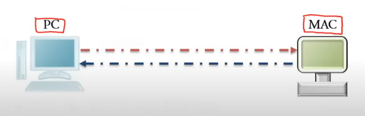
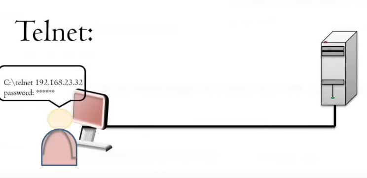

# 3.2 Interoperability Services

Section **3.0 Protocols and Services**.

TCP/IP does not care what operating system sits above it. **Interoperability services** are the application protocols that let unlike systems share files, shells, and directories anyway: a Linux host, a Windows host, and a Mac on one LAN.

## NFS

**Network File System** lets a host mount a remote directory as if it were local. It came from Unix and is still the normal file share between Unix and Linux systems. It is independent of the CPU and of the particular Unix flavor. Modern NFS runs over TCP (and can use UDP). The well-known port is **2049**. Older versions also used RPC portmapper (111), which firewalls have to allow or the mount never starts.

NFS trusts the network's user IDs unless you add Kerberos. An open NFS export to the world is a file server with the locks removed.

## SSH

**Secure Shell**, **TCP 22**, is an encrypted remote login. It replaces Telnet. The server authenticates the client with a password or, better, a key. The client authenticates the server by checking the server's host key, so a second machine cannot silently sit in the middle.

SSH also provides a tunnel: any TCP connection can be carried inside the encrypted session. That is why so many tools are "SSH underneath".

## SCP and SFTP

**SCP** (secure copy) copies files over SSH. Same port, **22**. The usual command form is `scp file user@host:path`. SCP is an old, simple tool. New work should prefer SFTP.

**SFTP** is a file-transfer protocol that also rides SSH on port 22. It can list directories, resume, and set permissions. It is not FTP, and it is not FTP over TLS (that one is FTPS and uses the FTP ports).

## Telnet

**Telnet**, **TCP 23**, is a terminal session in **cleartext**. The password crosses the network where anyone on the path can read it. It is still how some old serial-terminal gear and a few poorly maintained devices work. On anything you administer, use SSH. Seeing Telnet in a capture is a finding, not a feature.

## SMB

**Server Message Block** is the Windows file-and-printer sharing protocol. It also carries named pipes and a good deal of domain traffic. **CIFS** is an older name for the same family. Current SMB talks directly to **TCP 445**.

The legacy path is NetBIOS: UDP 137 (names), UDP 138 (datagrams), TCP 139 (sessions). You can disable NetBIOS if every device speaks SMB on 445. Many home networks still have both.

Samba is the Unix implementation of SMB, which is how a Linux server shows up in a Windows file dialog.

## LDAP

Covered with ports in 3.1. Short version: **TCP 389** for the directory, **TCP 636** when it is wrapped in TLS. It is the protocol; Active Directory, OpenLDAP, and the old Novell eDirectory and Apple Open Directory are the products. DNS has to work or clients never find the directory server.

## Zeroconf

**Zero-configuration networking** is how a small network works when nobody built a server. Four jobs, all automatic:

| Job | How |
|---|---|
| Address assignment | **APIPA / link-local.** If no DHCP server answers, the host picks `169.254.0.0/16` and checks that nobody else is using it (ARP probe). The host can talk on the local link only. It has no default gateway |
| Name resolution without DNS | **mDNS.** Names like `printer.local` are multicast on the LAN. UDP 5353 |
| Service discovery | **DNS-SD.** A host asks "who prints?" and printers answer. This is Bonjour and Avahi |
| Multicast addressing | The discovery traffic uses multicast, not a list of unicast addresses you had to type |

Zeroconf identifies speakers by their link addresses and by the names they announce. It is right for a home or a lab. It is not a substitute for DHCP and DNS in a company, because nothing central hands out a gateway, a domain search list, or a name you control.
