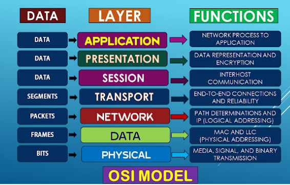

# 4.1 The OSI Model

Section **4.0 Models, Ethernet, and Wireless**.

The **Open Systems Interconnection** model is a teaching and design map published by ISO. It splits networking into seven layers so a vendor can build one layer and still interoperate with someone else's layer. Real stacks (TCP/IP) do not implement all seven as separate pieces of software. You still use the numbers every day: "layer 2" means MAC addresses and switches, "layer 3" means IP and routers.



A mnemonic, bottom to top: **Please Do Not Throw Sausage Pizza Away**.

## The seven layers

| Layer | Name | PDU | Job | Typical devices and protocols |
|---|---|---|---|---|
| 7 | Application | Data | The interface the program uses. This is not the application itself; it is the network service the application calls | HTTP, DNS, FTP, SMTP, SSH |
| 6 | Presentation | Data | Syntax: encoding, compression, encryption as a format. Turns "the app's data" into "a byte stream both sides parse the same way" | TLS, JPEG, MIME, ASCII/Unicode |
| 5 | Session | Data | Starts, manages, and ends a conversation. Dialog control, checkpoints | NetBIOS session, RPC, PPTP's session idea |
| 4 | Transport | Segment (TCP) or datagram (UDP) | End-to-end delivery between processes. Ports, reliability if the protocol offers it, flow control | TCP, UDP |
| 3 | Network | Packet | Logical addressing and path selection across multiple networks | IP, ICMP, routers |
| 2 | Data link | Frame | Delivery between two nodes on the **same** link. MAC addresses, error detection | Ethernet, Wi-Fi, switches, bridges |
| 1 | Physical | Bit | The signal on the medium. Voltage, light, radio, connectors, timing | Cables, hubs, repeaters, NICs' transceivers |

TCP calls its PDU a **segment**. UDP calls its PDU a **datagram**. Both are layer 4. IP calls its PDU a **packet**. Ethernet calls its PDU a **frame**. Using the wrong noun in an exam answer is how people miss an easy question.

## What each layer actually does

### Layer 1 — Physical

Moves **bits**. It does not know what a frame is. It defines connectors, pinouts, voltage or wavelength, bit timing, and whether the medium is shared. A hub and a repeater live here because they regenerate a signal without reading an address. A broken cable, a wrong duplex setting, and a dead laser are layer 1 faults. The symptom is usually "no link light" or errors at the bottom of the stack.

### Layer 2 — Data link

Moves a **frame** from one NIC to the next NIC on the same LAN. It detects errors (Ethernet's frame check sequence). It does not fix them; it drops the bad frame and lets a higher layer retransmit if that layer cares.

Two sublayers, from older IEEE 802:

| Sublayer | Role |
|---|---|
| LLC — logical link control | Multiplexes which layer-3 protocol this frame carries. The small header above the MAC header |
| MAC — media access control | The hardware address, and the rules for who may transmit (CSMA/CD, CSMA/CA) |

A **MAC address** is 48 bits, written as six hex bytes (`00:1A:2B:3C:4D:5E`). The first 24 bits are the vendor OUI. A burned-in address is meant to be globally unique. Locally administered addresses (including most virtual machines) set a flag in the first byte and may be anything the administrator picks.

Switches forward using the destination MAC and a table learned from source MACs. They do not change the IP header.

### Layer 3 — Network

Moves a **packet** from a source host to a destination host that may be many links away. The header holds source and destination **IP addresses**. Routers choose the next hop from a routing table. Each hop rewrites the layer-2 frame (new source and destination MAC) and keeps the IP packet, decrementing the TTL so a loop dies.

IP is **best effort**. It does not retransmit, does not order, and does not know about ports.

### Layer 4 — Transport

Moves data between **processes**, end to end, not just hop to hop. This is the first layer that talks only to the other host; routers normally do not rewrite it (NAT is the exception, and NAT is a hack on this layer).

- **Segmentation** cuts the application stream into pieces that fit a packet.
- **Port numbers** name the process.
- **TCP** adds reliability, ordering, and flow control (4.2).
- **UDP** does not. It is a thin wrapper with ports and a checksum.

The sending transport can also do **flow control** (do not overrun the receiver) and **error control** (retransmit what was lost). Those are TCP features, not layer-4 laws. UDP skips them on purpose.

### Layer 5 — Session

Decides that this request and that response belong to the same conversation, and can restart a conversation from a checkpoint. On TCP/IP this work mostly fell into the application (a login session, a database transaction) or into layer 4 (the TCP connection itself). NetBIOS and RPC are the textbook examples still worth naming.

### Layer 6 — Presentation

Gets both sides to agree on the *format* of the bytes: character set, image encoding, compression, and encryption of the payload. TLS is the modern example people care about. When an exam answer says "encryption and formatting", it is pointing here, even though TLS in real life sits in a library the application calls.

### Layer 7 — Application

Where network-aware programs meet the stack: a browser calling HTTP, a mail client calling SMTP, a resolver calling DNS. The layer provides the service interface. Chrome is not "layer 7". HTTP is.

## Encapsulation

Sending, top down: each layer wraps the layer above in its own header.

```text
Application data
  → segment   (TCP header + data)
    → packet  (IP header + segment)
      → frame (Ethernet header + packet + FCS)
        → bits on the wire
```

Receiving, bottom up, is **decapsulation**: check the frame, strip it, route on the IP header, strip it, deliver the segment to the port, strip it, hand bytes to the application.

A switch looks at the frame and ignores the rest. A router strips the frame, looks at the packet, and builds a new frame for the next link. Neither of them needs to know it is HTTP.

## OSI versus TCP/IP

TCP/IP is the stack that is actually deployed. OSI is the vocabulary. The mapping:

| OSI | TCP/IP (4 layer) | TCP/IP (5 layer, what people teach now) |
|---|---|---|
| Application, presentation, session | Application | Application |
| Transport | Transport | Transport |
| Network | Internet | Internet |
| Data link, physical | Link / network access | Link, then physical as its own layer |

The 4-layer model is the original DoD model. The 5-layer model splits the link so physical and data-link questions have somewhere to live. Both are "TCP/IP". Full behavior of that model, and of TCP itself, is 4.2.
