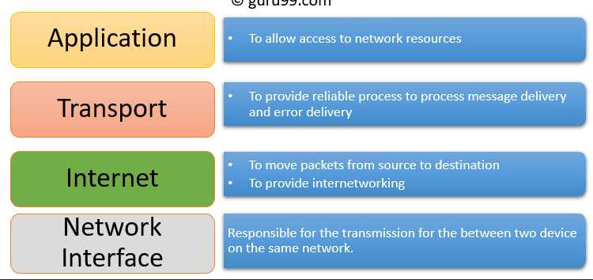
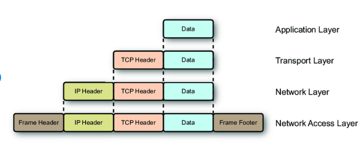
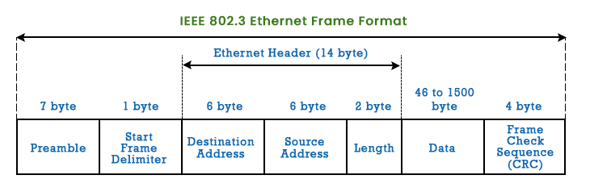

# 4.2 TCP/IP and TCP

Section **4.0 Models, Ethernet, and Wireless**. This is the full treatment of the TCP/IP model, the TCP header, the connection lifecycle, and how TCP differs from UDP and from IP.

## The TCP/IP model

TCP/IP is the protocol suite the Internet actually runs. It was funded by US DoD research (ARPANET) and standardized through RFCs. The current TCP specification is **RFC 9293**, which replaces RFC 793. IP is connectionless. TCP, which rides on IP, adds the connection.

Four layers, top to bottom:

| TCP/IP layer | What it does | Protocols |
|---|---|---|
| Application | Process to process, in the format the program wants | HTTP, DNS, SMTP, SSH, DHCP |
| Transport | End-to-end, between ports. Reliable or not, by choice | TCP, UDP |
| Internet | Hop-by-hop forwarding between networks | IP, ICMP, IGMP. Routing protocols feed this layer |
| Link (network access) | One hop, on one medium. MAC addresses, framing, bits | Ethernet, Wi-Fi, PPP |



Encapsulation, using the names from 4.1:



```text
data  →  TCP segment  →  IP packet  →  Ethernet frame  →  bits
```

### How this differs from OSI

| Question | OSI | TCP/IP |
|---|---|---|
| Layers | 7, designed first as a model | 4 (or 5), designed around working protocols |
| Where it is used | Vocabulary, troubleshooting, exam answers | The packets on the wire |
| Reliability | Described at several layers | A choice at the transport layer. IP itself does not promise delivery |
| Development | Formal, vertical, one layer's service to the next | Protocols were written to solve a problem and then fitted to the model |

Ignore comparison charts that say "OSI guarantees delivery and TCP/IP does not", or the reverse. OSI does not move packets. TCP guarantees delivery. IP does not. UDP does not. The model is not a protocol.

## IP, briefly, because TCP sits on it

**Internet Protocol** is connectionless and best effort. It defines the packet header, the address, and fragmentation. It does not retransmit, order, or know which program the bytes belong to. IPv4's protocol number for TCP is **6**. UDP is **17**. ICMP is **1**. Addressing and the IP header are 5.1 and 5.2.

The link layer, under IP, delivers a frame to the next NIC using a **MAC address**. IP's problem ("which network?") and Ethernet's problem ("which NIC on this wire?") are different, which is why ARP exists (5.2).

### Ethernet frame, the link wrapper around the IP packet



| Field | Size | Purpose |
|---|---|---|
| Preamble | 7 bytes | Alternating 1 and 0 so the receiver locks its clock |
| SFD — start frame delimiter | 1 byte | `10101011`. Says "the header starts now" |
| Destination MAC | 6 | Who on this LAN should copy the frame off the wire |
| Source MAC | 6 | Who sent it. Switches learn this |
| EtherType / length | 2 | If ≥ 1536, it is a type (0x0800 means IPv4, 0x86DD means IPv6, 0x0806 means ARP). If smaller, it is an 802.3 length |
| Payload | 46–1500 | The IP packet. Padded to 46 if it is shorter |
| FCS | 4 | CRC-32. The receiver drops the frame if the check fails |

The preamble and SFD are physical signaling. The FCS covers the frame from the destination MAC through the payload. A bad FCS is a layer-2 error; TCP never sees that frame.

**Interframe gap** is 12 bytes of silence (96 bit times at the link rate) so stations can tell two frames apart.

**Protocol binding** is the host setting that associates a layer-3 protocol (IPv4, IPv6) with a NIC, and decides the order the host tries them. One NIC routinely has both IPv4 and IPv6 bound. That is not two cables. It is two addresses on one interface.

## What TCP gives you

TCP is a **connection-oriented, reliable, ordered, byte-stream** service between two sockets.

| Property | Meaning |
|---|---|
| Connection-oriented | Both sides keep state. Data flows only after a handshake, and only until a teardown |
| Reliable | Lost segments are retransmitted. The sender keeps a copy until it is acknowledged |
| Ordered | Bytes are handed to the application in the order they were sent, even if the packets arrived shuffled |
| Byte stream | TCP does not preserve your message boundaries. Two 100-byte writes can arrive as one 200-byte read |
| Flow controlled | The receiver tells the sender how much buffer it has left |
| Congestion controlled | The sender slows down when the path is full, even if the receiver has buffer |
| Error checked | A checksum covers the header, the data, and a pseudo-header of the IP addresses |

UDP is the alternative when you would rather drop a late packet than wait for a retransmission: voice, live video, DNS queries, games.

## Sockets

A TCP connection is identified by a **4-tuple**:

```text
source IP, source port, destination IP, destination port
```

Two browser tabs to the same web server differ in the source port. A server can hold tens of thousands of connections on port 443 because each client's tuple is unique.

The server side calls listen, then accept. The client side picks an ephemeral port and calls connect, which starts the handshake.

## The TCP header

Minimum **20 bytes**. Options can extend it up to **60 bytes**. There is no payload length field; the length comes from the IP total length minus the headers.

| Field | Bits | What it is for |
|---|---|---|
| Source port | 16 | Sending process |
| Destination port | 16 | Receiving process |
| Sequence number | 32 | The number of the first data byte in this segment |
| Acknowledgment number | 32 | The next byte the sender of this segment expects. Valid only if ACK is set |
| Data offset | 4 | Header length in 32-bit words. 5 means "20 bytes, no options" |
| Reserved | 4 | Set to zero |
| Flags | 8 | Control bits, below |
| Window | 16 | How many bytes the sender of this segment is willing to receive. Flow control |
| Checksum | 16 | Header + data + pseudo-header (source IP, dest IP, protocol, TCP length) |
| Urgent pointer | 16 | Offset of urgent data, only if URG is set. Rare |
| Options | 0–320 | MSS, window scale, SACK, timestamps |

### Flags

| Flag | Name | Set when |
|---|---|---|
| SYN | Synchronize | Opening a connection. The sequence number is the initial one |
| ACK | Acknowledgment | The acknowledgment field is meaningful. Set on every segment after the first SYN |
| FIN | Finish | This side is done sending. The other side may still send |
| RST | Reset | Abort. "This connection does not exist" or "I refuse it" |
| PSH | Push | Deliver the buffered bytes to the application now. Do not wait to fill a buffer |
| URG | Urgent | The urgent pointer is valid |
| ECE, CWR | ECN | Explicit congestion notification. The path marked the packet, and the sender is cutting its rate. Optional |

A segment can have several flags. `SYN` alone starts a connection. `SYN+ACK` answers it. `FIN+ACK` is a normal close. `RST` is immediate and not polite.

### Options you should recognize

**MSS (maximum segment size).** Sent in the SYN. "The largest payload I can receive." It is not negotiated as a single value; each side announces its own, and the sender uses the other side's MSS. On Ethernet, MSS is usually **1460**: 1500 MTU − 20 IP − 20 TCP.

**Window scale.** The 16-bit window field tops out at 65535 bytes, which is far too small for a fast long-distance link. The scale option, also only in the SYN, multiplies the window by up to 2^14. Both sides must send it or it is off.

**SACK (selective acknowledgment).** Lets the receiver say "I have bytes 1000–1999 and 3000–3999" so the sender retransmits only the hole. Without SACK, a loss can cause retransmission of data that already arrived.

**Timestamps.** Measure round-trip time and protect against old segments with wrapped sequence numbers on very fast links.

## Sequence numbers

TCP numbers **bytes**, not segments. If the application writes 3000 bytes and MSS is 1460, the segments carry sequence numbers S, S+1460, and S+2920.

The acknowledgment number is **cumulative**: "I have every byte up to, but not including, this number." An ACK of 5001 means bytes through 5000 are safe, and the sender may discard its copies of them. Duplicate ACKs (the same number, again) mean "I am still missing the byte at that number" and are the signal for fast retransmit.

The initial sequence number is not zero. Each side picks one so old segments from a previous connection are not accepted by accident.

## Three-way handshake

No data is delivered to the application until this finishes. Both sides must know the other's initial sequence number.

```text
Client                              Server
  | ---- SYN, seq = x ------------> |     SYN-SENT
  | <-- SYN-ACK, seq = y, ack = x+1 |     SYN-RECEIVED
  | ---- ACK, seq = x+1, ack = y+1 >|     ESTABLISHED
```

1. **SYN.** Client picks initial sequence number `x` and sends SYN. It has no acknowledgment yet.
2. **SYN-ACK.** Server picks its own initial sequence number `y`, sets ACK to `x+1` (the next byte it expects, which is the first data byte; the SYN itself consumes one sequence number), and sends SYN+ACK.
3. **ACK.** Client acknowledges `y+1`. The connection is established. This third segment may already carry data.

Why three messages, not two: each side's sequence number has to be acknowledged, and the client must confirm it saw the server's SYN. Two messages would leave the server unsure whether the client received `y`.

**Half-open** is the state after the server has sent SYN-ACK and is waiting for the final ACK. A **SYN flood** sends many SYNs and never completes the handshake, so the server's table of half-open connections fills and legitimate clients cannot connect. SYN cookies are the usual defense: the server encodes its state in the sequence number and does not store anything until the final ACK. Knowing the name and the effect is the exam objective. Building one is not a lab exercise.

## Sending data

After establishment:

1. The application writes bytes. TCP may combine small writes (Nagle's algorithm) or split large ones at MSS.
2. Each segment gets the next sequence number and a checksum.
3. A copy stays in the **send buffer** until it is acknowledged.
4. The receiver checks the checksum, places the bytes in order in the **receive buffer**, and sends an ACK of the next byte it still needs.
5. Out-of-order bytes are held, not given to the application, until the hole is filled. With SACK the receiver reports them so the sender does not guess.

**Retransmission** happens two ways:

- The retransmission timer expires. RTO is based on the smoothed round-trip time, plus variance. A timeout means the network is assumed badly congested, so TCP drops its sending rate hard.
- Three duplicate ACKs arrive. The receiver has gotten later bytes and keeps asking for the missing one. The sender retransmits that segment immediately (**fast retransmit**) without waiting for the timer.

**PSH** tells the receiving TCP to hand bytes to the application instead of waiting for more. Interactive sessions (SSH keystrokes) want this. Bulk transfer does not care.

## Flow control: the sliding window

Flow control protects the **receiver**, not the network.

The receiver advertises a **window** (rwnd): how many bytes past the last ACK it still has buffer for. The sender may have at most that many bytes in flight. As ACKs arrive, the window slides forward, which is the "sliding window".

```text
acked |---- sent, not acked ----|---- may send ----|  not yet
      ^                          ^
      last ACK                   last ACK + window
```

If the application stops reading, the buffer fills and the receiver advertises a **zero window**. The sender stops. It probes with tiny segments later, so it notices when the window reopens. A zero window is a slow application, not a broken cable.

## Congestion control

Flow control will happily fill a link until a router starts dropping packets. Congestion control protects the **path**.

The sender keeps a **congestion window (cwnd)** and sends no more than the smaller of cwnd and the receiver window.

| Phase | Behavior |
|---|---|
| Slow start | cwnd starts small (a few MSS) and roughly doubles every round trip. Growth is exponential, which is not actually slow |
| Congestion avoidance | After cwnd passes a threshold (ssthresh), it grows by about one MSS per round trip. Linear |
| Fast retransmit / fast recovery | On three duplicate ACKs, retransmit the missing segment, cut cwnd about in half, and continue in congestion avoidance. The path is lossy but not dead |
| Timeout | Retransmit, drop ssthresh, set cwnd back to the slow-start value, and slow-start again. Assumed to be serious congestion |

Loss is the signal, because ordinary routers do not phone the sender. ECN is the polite version: a router sets a bit instead of dropping, and the TCP flags ECE and CWR carry that news.

## Closing the connection

Each direction closes independently. A FIN means "I will send no more data." The other side ACKs it and may keep sending.

```text
Client                              Server
  | ---- FIN, seq = u ------------> |
  | <--- ACK, ack = u+1 ----------- |     client is in FIN-WAIT, server in CLOSE-WAIT
  |                                 |     server application finishes and closes
  | <--- FIN, seq = v ------------- |
  | ---- ACK, ack = v+1 ----------> |     server is done
```

FIN consumes one sequence number, the same way SYN does.

The side that sent the first FIN then waits in **TIME-WAIT** for **2 × MSL** (maximum segment lifetime, commonly treated as 2 minutes, so TIME-WAIT is often 4 minutes). That wait:

- lets the final ACK be retransmitted if it was lost
- lets old duplicate segments from this connection die before the same 4-tuple is reused

A server that is restarting and "cannot bind, address in use" is often looking at sockets still in TIME-WAIT. That is TCP working, not a stuck process.

**RST** aborts. It is not acknowledged and does not wait. You see it when a client talks to a closed port (the classic "connection refused"), when a firewall kills a flow, or when a host receives a segment for a connection it has no state for.

## State machine

The states you will actually meet in `netstat` or `ss`:

| State | Which side | What is true |
|---|---|---|
| LISTEN | Server | Socket is waiting for SYNs. No connection yet |
| SYN-SENT | Client | SYN is out, waiting for SYN-ACK |
| SYN-RECEIVED | Server | SYN-ACK is out, waiting for the final ACK. Half-open lives here |
| ESTABLISHED | Both | Handshake done. Data may flow |
| FIN-WAIT-1 | The closer | FIN sent, waiting for ACK |
| FIN-WAIT-2 | The closer | My FIN is ACKed. Waiting for the other side's FIN |
| CLOSE-WAIT | The peer | I ACKed their FIN. My application has not closed yet |
| LAST-ACK | The peer | I have sent my FIN. Waiting for the last ACK |
| TIME-WAIT | The closer | I ACKed their FIN. Waiting 2MSL |
| CLOSED | Both | No state left |

A socket stuck in CLOSE-WAIT means the **application** received the close and never called close itself. That is a software bug, not a network fault. A pile of SYN-RECEIVED is a handshake that is not finishing (loss, or a SYN flood).

## MSS, MTU, and fragmentation

| Term | Meaning |
|---|---|
| MTU | Largest IP packet the link will carry. Ethernet's standard MTU is **1500** bytes |
| MSS | Largest TCP payload. Announced in the SYN. Typically MTU − 40 = **1460** on Ethernet |
| Path MTU | The smallest MTU along the route. A 1500-byte packet that meets a 1400-byte tunnel is a problem |

IPv4 can fragment a packet that is too big. Fragmentation is slow and fragile, and a lost fragment loses the whole packet. Modern stacks set the **Don't Fragment** bit and use **path MTU discovery**: if a router cannot forward the packet, it sends ICMP "fragmentation needed", and the sender shrinks its MSS. If a firewall drops that ICMP, connections hang once they send a large segment (small ones, like the handshake, still work). That symptom is a classic troubleshooting tell.

Jumbo frames raise the Ethernet MTU to about 9000. Every device on the VLAN has to agree, including the switches. One 1500-byte device in the path black-holes the large frames.

## Checksum and what it does not cover

The TCP checksum includes a **pseudo-header**: source IP, destination IP, protocol number (6), and TCP length. A segment delivered to the wrong host fails the checksum. It is only 16 bits, so it is not a security feature and it is weaker than Ethernet's CRC plus a higher-layer check. It is there to catch the errors the link CRC did not, especially corruption inside a router.

## TCP compared with UDP

| | TCP | UDP |
|---|---|---|
| Connection | Handshake, then state | None. Send when you like |
| Reliability | Retransmit until ACKed | Best effort |
| Order | Guaranteed | Not guaranteed |
| Header | 20 bytes minimum | 8 bytes: source port, dest port, length, checksum |
| Flow control | Window | None |
| Congestion control | Slow start, avoidance | None. A UDP flow can crowd out TCP, which is polite by design |
| Message boundaries | Byte stream | One datagram in, one datagram out (or dropped) |
| Used by | HTTP, SSH, SMTP, FTP, IMAP | DNS, DHCP, NTP, SNMP, VoIP media, streaming, games |
| IP protocol number | 6 | 17 |

If the application can detect a gap and ask again in its own way (DNS asks once and retries the query), UDP is less work. If a missing byte corrupts a file, use TCP and do not reinvent it.

## What people confuse

- TCP does not assign IP addresses. DHCP does, and DHCP is UDP.
- A port is not a physical jack. "Port 443" is a number in a header.
- ACK is both a flag and a field. The field is the next expected byte. The flag says the field is valid.
- The window is the receiver's buffer advertisement, not the bandwidth.
- Closing is four messages in the common case (FIN, ACK, FIN, ACK), and the two FINs are independent. It is not a "three-way goodbye".
- OSI layer 4 is where TCP lives. The TCP/IP transport layer is the same place. Numbered from the bottom, layer 4 of the *four-layer* TCP/IP model is the **application** layer, not transport. Prefer the names (transport, internet) and reserve layer numbers for OSI.
