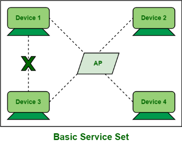
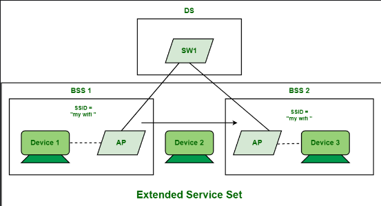
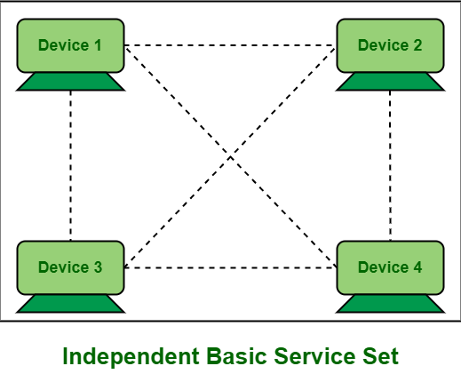
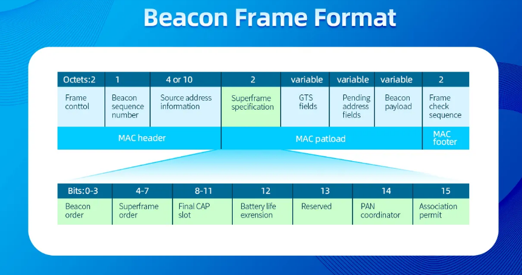
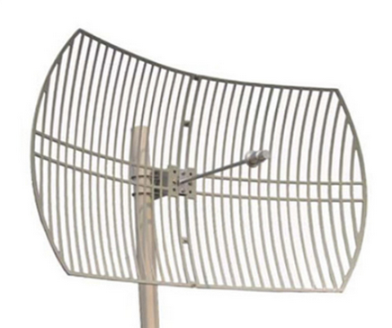
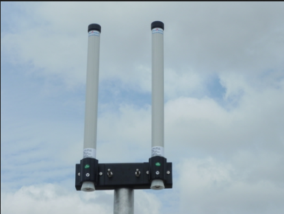

# 4.4 Wireless Networks

Section **4.0 Models, Ethernet, and Wireless**. Media basics (radio, spread spectrum, Bluetooth, the SSID) are in 1.7. This note is the LAN architecture and the 802.11 standards.

## Pieces of a WLAN

| Term | Meaning |
|---|---|
| STA — station | Any device with a wireless NIC: laptop, phone, AP |
| AP — access point | Bridges wireless stations onto the wired LAN. In a BSS it is the center |
| BSS — basic service set | One AP plus its associated stations. The AP controls the cell |
| ESS — extended service set | Several BSS cells that share one SSID and are connected by a wired (or wireless) backbone. Clients roam between APs |
| IBSS — independent BSS | No AP. Stations talk directly. Also called **ad hoc**. Fine for two machines, painful to secure |
| SSID | The network name, up to 32 octets. An ESS uses one SSID across many APs |
| BSSID | The AP's radio MAC. It identifies the cell, while the SSID identifies the network |
| WDS — wireless distribution system | Connects APs to each other over wireless instead of Ethernet. A repeater or a bridge. You give up throughput, because the same radio spends airtime on the backhaul |
| DS — distribution system | The backbone that joins APs in an ESS. Usually a switch |

Infrastructure mode is BSS/ESS. Ad hoc is IBSS. If the question says "no access point", the answer is ad hoc or IBSS.

## 802.11

IEEE 802.11 is Wi-Fi. It uses **CSMA/CA** (2.2), not CSMA/CD. The original standard used the 2.4 GHz band and topped out at 2 Mbps. Everything since is an amendment.

| Standard | Wi-Fi name | Band | Top PHY rate (typical textbook) | What changed |
|---|---|---|---|---|
| 802.11-1997 | — | 2.4 GHz | 2 Mbps | DSSS or FHSS |
| 802.11a | — | 5 GHz | 54 Mbps | OFDM. Not compatible with b |
| 802.11b | — | 2.4 GHz | 11 Mbps | DSSS. The one that made Wi-Fi common |
| 802.11g | — | 2.4 GHz | 54 Mbps | OFDM, and it talks to b clients. A b client on a g AP slows the cell |
| 802.11n | Wi-Fi 4 | 2.4 and 5 GHz | 600 Mbps (4 spatial streams, 40 MHz) | MIMO, channel bonding. 150 Mbps is **one** stream, not the standard's ceiling |
| 802.11ac | Wi-Fi 5 | 5 GHz only | Gbps, with 80/160 MHz channels | Downlink MU-MIMO, more streams |
| 802.11ax | Wi-Fi 6 / 6E | 2.4, 5, and **6 GHz** for 6E | Higher efficiency more than a bigger headline number | OFDMA (many clients at once), uplink and downlink MU-MIMO, BSS coloring |
| 802.11be | Wi-Fi 7 | 2.4, 5, 6 GHz | Multi-gig, 320 MHz channels | Multi-link operation: one client uses two bands at once |

Rates in the table are signaling rates before protocol overhead, and only with a clean signal and the widest channel. A laptop on the far side of a wall will be on a slower modulation. That is normal.

**MIMO** uses several antennas to send several spatial streams. **MU-MIMO** sends those streams to different clients at the same time. **OFDMA**, added in Wi-Fi 6, slices a channel so several clients transmit in one slot. MIMO is "more lanes". OFDMA is "several cars sharing one slot".

### Channels

2.4 GHz has three non-overlapping 20 MHz channels in most of the world: **1, 6, and 11**. Adjacent APs on channel 1 and 2 interfere. Adjacent APs on 1 and 6 do not.

5 GHz has many more non-overlapping channels, including wider 40, 80, and 160 MHz ones. Some of those channels are shared with radar and require **DFS**: the AP must leave the channel if it hears radar.

6 GHz (Wi-Fi 6E and 7) is the clean band. Older clients cannot use it.

### Beacons

An AP sends a **beacon** about every 100 ms (the interval is configurable). The beacon advertises the SSID, the rates, the security suite, and the timestamp stations use to stay aligned. Stations use it to find the network and to decide whether they can join.

A beacon is not 50 bytes as a fixed rule. The SSID field can be up to 32 bytes, and the frame grows as the AP adds information elements (security, country, capabilities). Hiding the SSID removes it from the beacon and does not stop a station from asking, or from revealing the name when it associates.

Association, in order: scan (passive beacons or an active probe), authenticate, associate, then (with WPA) the 4-way handshake that derives the encryption keys. DHCP happens after the client is associated. A client that associates and never gets an address has a working radio and a broken DHCP path.

## Antennas

An antenna converts the radio's electrical signal into a wave, and the reverse. **Gain**, in dBi, is how much the antenna concentrates energy compared with an ideal radiator that sprays equally in every direction. Gain does not create power. It steals it from the directions you do not care about. A higher-gain antenna is more directional, or flatter in the vertical plane, not magically louder.

| Type | Pattern | Use |
|---|---|---|
| Omnidirectional | 360° in the horizontal plane. A doughnut, not a sphere | Ceiling AP in the middle of a floor |
| Directional (patch, yagi, parabolic) | A beam | Hallway, a long aisle, a building-to-building link |
| Semidirectional | A wide cone | Covering one room from a corner |

More isotropic-equivalent gain means a tighter beam. Point a directional antenna and you have also pointed the nulls. Clients behind the antenna hear nothing.

### What hurts the signal

| Medium | What gets in the way |
|---|---|
| Infrared | Anything that blocks light: walls, sun, smoke, dust. Needs line of sight |
| Microwave point-to-point | Distance, rain, and anything in the Fresnel zone. Also line of sight |
| Wi-Fi | Absorption (water, people, brick), reflection (metal), interference on the same channel, a client radio with less power than the AP |
| Bluetooth | Distance, its low power limit, and other 2.4 GHz users (Wi-Fi, microwaves) |

**Latency** is the delay from source to destination. One-way delay and round-trip time are different numbers; TCP's RTT is round trip (4.2). Wireless adds latency when the station waits for a clear channel, and jitter (variation in that delay) is what damages voice.

## Putting an AP in

Planning, then installation.

1. Collect the floor plan, the wall types, and where people actually sit.
2. Write the requirements: how many clients, which standards, guest versus staff, authentication.
3. Design: AP count, channels, power, where the wired uplinks go.
4. Survey the floor. A design that ignores the existing neighbor's channel 1 is a guess.
5. Mark placement. High and clear of metal and of the microwave in the break room.
6. Install: patch the AP to the switch, change the default admin password, set SSID, WPA2 or WPA3, channel, and the ACL or RADIUS server.
7. Configure a client and test roaming, not just "the icon says connected".
8. Document the channel plan and the passwords somewhere other than the AP.

The first five steps are the plan. The last three are the install. Skipping the survey is why a second AP on the same channel makes the network worse.

Band steering, 802.11h (radar on 5 GHz), channel width, autonomous versus lightweight APs, and WPS are in 12.5.
